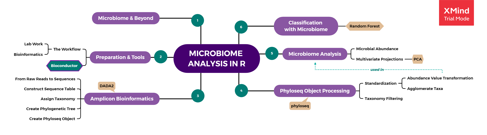

# microbiome

Exploring microbiome analysis using R.

Read mini article on [Rpubs](https://rpubs.com/nabiilahardini/microbiome)!

Explore [the microbiome book](https://microbiome.netlify.com/)!

Feedback and discussion is appreciated :)
