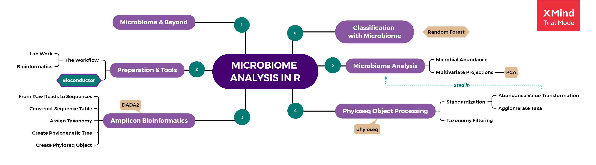

# Microbiome Analysis Workflow

The workflow of microbiome analysis has evolved through out the years. The development of technology and Bioinformatics has made a massive increment on the generation of genomic data that is used for microbiome analysis. Therefore, the use of programming tools such as R and its packages is becoming more widely used. 

If I may put it into 2 major steps, microbiome analysis consist of "Lab Work" and "Bioinformatic Analysis". The lab work of a microbiome analysis is quite plenty and mostly technical, which I will not explain it detail in here. Meanwhile, the bioinformatic analysis will be explained in this book with some tutorial. We will be using R languages and its packages as bioinformatics tools.

## The Lab Work

Every lab work of a microbiome analysis begins by taking a sample of microbial community from either soil, water, swab of a surface, saliva, or any other habitat. The microbes present in that sample will then be filtered and extracted for their DNA. Each microbial DNA will be sequenced to retrieve its genetic code, specifically in the region of a "fingerprint gene" called the *16S ribosomal RNA (16S rRNA)*. The process briefly explained in the illustration below (**Fig 2.1**).

 

 

For those of you who are not familiar with cell and molecular biology, these are a brief explanation. DNA is a molecule that harbors genes or sequences of genetic code of a living things. This DNA can be used as a taxonomic marker that differentiate each microbial species from one another. A specific region of DNA called the 16S rRNA gene is usually used for comparation, for this gene exist in all of microbes but has slightly different sequence for each microbes. The difference between each sequence will be calculated to determine how distant or related a microbial species with one another.

## Bioinformatic Analysis

After we have the sequencing result, the bioinformatic analysis can be performed. The steps consist of assigning taxonomy or giving identity to the unknown DNA samples and analysis of the their community structure and dynamics. 

We can analyze the community structure and dynamics by calculating the diversity and abundance of each microbes present in the samples. We will able to know which microbes dominates over the other, what microbial activities it can do that may affect the environment being studied, etc. This microbial community profile will help us understand the phenomenon happen in a specific environment. We may even discover potential biomarker for industrial application.

From the technical side, the steps of bioinformatic analysis starts from the dirty data cleaning, performing some data pre-processing, followed by applying some algorithms, and finalized by some data visualization and extracting valuable insight. Below is the summary of Bioconductor Workflow for Microbiome Data Analysis adapted from @callahan16 and several documentation from updated packages commonly used for microbiome analysis. [Bioconductor](https://www.bioconductor.org/) itself is a repositories of open source software for Bioinformatics, based on packages written primarily in the R programming language. 

1. Amplicon Bioinformatics: from raw reads to table.
2. Phyloseq Object Processing: pre-processing of sequence data in phyloseq format.
3. Microbiome Data Analysis: data exploration using common plots and PCoA.
4. Classification Problem on Microbiome Data [Additional]

We will discuss deeper for each steps of microbiome analysis and the packages related to it in the following chapter. A tutorial installing Bioconductor packages also provided in the next chapter, for it is slightly different than what we usually do when installing packages from [CRAN](https://cran.r-project.org).

