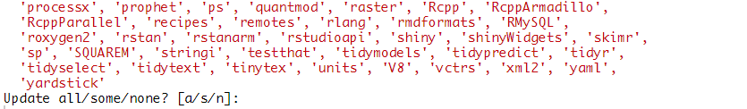

# Bioconductor Installation

Numerous packages for bioinformatics analysis stored in Bioconductor repository. The current release of Bioconductor is version 3.10 and works with R version 3.6.0. Users of older R and Bioconductor must update their installation to take advantage of new features and to access packages that have been added to Bioconductor since the last release [@bioconductor]. Install the latest version of Bioconductor by entering the commands below:

```{r eval=FALSE}
if (!requireNamespace("BiocManager", 
                      quietly = TRUE)) # progress & error suppressed
install.packages("BiocManager")
BiocManager::install(version = "3.10")
```

In additition, if you see the following messege during installation:

<br>
<center>

</center>
<br>

That's its way to notice you that there are some packages (usually from CRAN repository) that is out-of-date. You can type `a` in the console to install the latest updates or any other option available (some or none). You may also install the latest updates manually from the 'Packages' panel.

To install specific packages from Bioconductor, use the following commands:

```{r eval=FALSE}
# packages for microbiome analysis
BiocManager::install(c("dada2", 
                       "phyloseq", 
                       "DECIPHER", 
                       "phangorn"))
```

Now, many have questioned why there is a need to use `BiocManager::install()` to install packages from Bioconductor. This is because Bioconductor has a repository and release schedule that differs from R. A consequence of the mismatch between R and Bioconductor release schedules is that the Bioconductor version identified by `install.packages()` is sometimes not the most recent ‘release’ available. The BiocManager package serves as the primary way to ensure that the appropriate Bioconductor installation is used with respect to the version of R in use regardless of the R and Bioconductor release cycles [@bioconductor].

For further documentation of the installation of Bioconductor, click [here](https://www.bioconductor.org/install/).