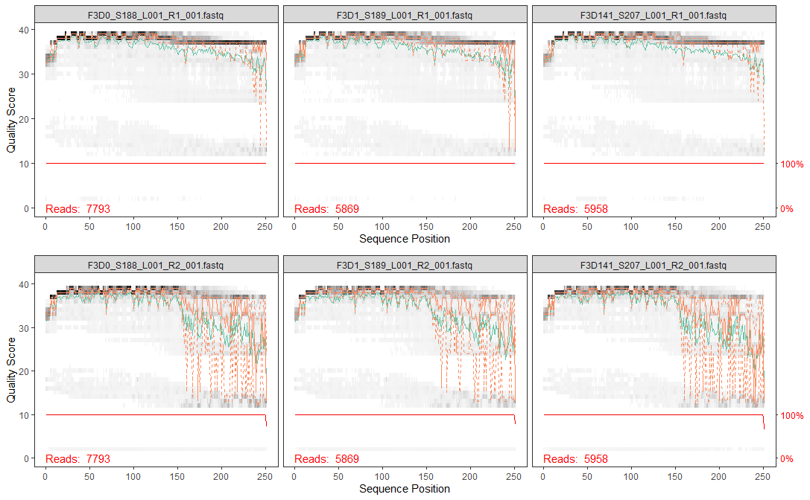

# Amplicon Bioinformatics: Data Cleaning

This section demonstrates the first step of performing microbiome analysis in R. Amplicon bioinformatics is the steps of how we prepare a raw data into format needed for analysis. The steps include **construction of the raw reads from sequencing result into the table we ought to analyze**. 

## Libraries

First, we should load the necessary packages. You might also want to install some packages if you haven't installed them to your machine.

```{r eval=F}
# install packages
BiocManager::install("BiocStyle")
```

```{r message=FALSE, warning=FALSE}
# libraries
library(knitr) # for reporting
library(ggplot2) # for graph visualization
library(tidyverse)
library(gridExtra) # additional mapping for ggplot2
library(BiocStyle)
library(dada2)
library(phyloseq)
library(DECIPHER)
library(phangorn)
```

## Dataset

```{r include=FALSE}
# clear-up the environment
rm(list = ls())

# load data
load("assets/04/amplicon.RData")
```

The dataset for microbiome analysis is usually a set of **raw reads of DNA sequences** a.k.a. **amplicons** stored in a digital format as a result of **DNA sequencing method** performed in labs. The DNA of a microbial species needs to be sequenced first to retrieve its information and store it in a digitalized form. There are various tools for DNA sequencing with the **Next Generation Sequencing (NGS)** technology being commonly used today. It allows rapid sequencing for a massive load of DNA sequences. 

You are free to use your own amplicons dataset while following the tutorial provided in this book. Meanwhile, if you don't have one, you can use the data provided free in [here](http://www.mothur.org/MiSeqDevelopmentData/StabilityNoMetaG.tar). The data is also used on the original "Bioconductor Workflow for Microbiome Data Analysis". The data consisted of amplicons from the V4 region of the 16S rRNA gene sequenced through [Illumina Miseq NGS technology](https://sapac.illumina.com/systems/sequencing-platforms/miseq.html?langsel=/id/). The **V4 region** stands for the more specific region of the **16S rRNA gene**, the "fingerprint gene" which we will use to explain the identity of microbial species inside the community we ought to analyze. The data contains **DNA samples of microbial communities** from a 360 fecal samples, collected from 12 mice over the first year of life. This samples were investigated for analyzing the development and stabilization of the murine microbiome [@schloss12].

These are the steps for reading the data:

1. The data can be downloaded in the link provided above. The data will be in `.tar` format. It stands for *Tape Archive* or *Consolidated Unix Archive format*.
2. You will need to extract it to obtain the amplicons in `.fastq.gz` stands for *gzip compressed archive* format. 

There will be **724 files** consisted of:

* 360 forward reads of community DNA samples
* 360 reverse reads of community DNA samples
* 2 forward reads of control (mock) samples
* 2 reverse reads of control (mock) samples

For those of you who are interested in understanding more about the sample it is a good idea to read the [original research publication](https://www.ncbi.nlm.nih.gov/pmc/articles/PMC3463496/) and perhaps also [articles](https://drive5.com/usearch/manual/otu_qc_controls.html) about designing an experiment including its control.

The amplicons are stored with a standard naming system with an "R1" and "R2 label as forward and reverse reads respectively. Forward and reverse reads came from the sequencing method itself which sequenced DNA in two direction just as illustrated in **Fig 4.1**. Here is a great [video](https://www.youtube.com/watch?v=ONGdehkB8jU) about DNA sequencing for more detailed process.

FIG 4.1 [dna sequencing with r/f primers]

Before further analysis, forward and reverse reads of DNA need to be "cleaned" first for its low quality reads and then joined to obtain the full DNA. The data cleaning process is called **Trimming and Filtering** which we will discuss in the next section. Below, the amplicons will be tagged for data cleaning process. 

The amplicons are still in its compressed format but luckily most bioinformatics tools have the ability to process the compressed files. This is quite a convenience as most microbiome analysis deals with large-sized data and compressed files are, well, more "compressed". The code below will try to list all the amplicons stored in our working directory and separate them between the reverse or forward reads for the data cleaning process. 

```{r}
# list all sequence files
amplicons <- sort(list.files(path = "data/miseq", # location of your amplicon files
                             full.names = TRUE))
head(amplicons)
```

```{r}
# search for a pattern in the list 
# R1 = DNA forward sequences; R2 = DNA reverse sequences

amplicons_F <- amplicons[grepl("R1", amplicons)] 
amplicons_R <- amplicons[grepl("R2", amplicons)]
```

## Trimming & Filtering

After we have separate the sequences into reverse/forward, we need to perform data cleaning by **trimming & filtering**. Raw reads are often have regions with low-quality reads. Most Illumina sequencing data shows a trend of decreasing average quality towards the end of sequencing reads [@callahan16]. 

To know which regions have low quality reads, we can plot it using `plotQualityProfile()` from **dada2** package for amplicon analysis. This function plots a visual summary of the distribution of [**quality scores**](https://www.illumina.com/documents/products/technotes/technote_Q-Scores.pdf) for each sequence position. For more clarity, one amplicon files consist of numerous DNA sequences from each microbial present in one community sample. Each sequences calculated for its quality score in each sequence position (first to last). The plot will generate the summary of quality score from all the DNA sequences in one sample.

Let's take the first 3 observation and plot its reverse and forward reads for its quality profile. From there we can determine which position with low quality reads and trim them later.

```{r eval=FALSE}
# plotting 1st observation
f_plot <- plotQualityProfile(amplicons_F[1:3]) + labs(x = "Sequence Position")
r_plot <- plotQualityProfile(amplicons_R[1:3]) + labs(x = "Sequence Position")

grid.arrange(f_plot,r_plot,ncol = 1)
```

```{r, echo = FALSE, fig.align = "center", out.width = "100%"}

```

The distribution of quality scores at each sequence position is shown as a grey-scale heatmap. The darker color represent higher frequency of each quality score at each sequence position. Notice that I've intentionally changed the x label for easier interpretation. It also shown the quality score summary:

* **green line**: mean quality score
* **orange line-solid**: median quality score
* **orange line-dashed**: 25th and 75th quantiles
* **Reads**: number of reads (DNA sequences present in a sample)
* **red line**: scaled proportion of reads that extend to at least that position (this is more useful for other sequencing technologies, as Illumina reads are typically all the same length, hence resulting a flat red line).

The forward reads are in good quality, but it is still better to trim a few of the first/last position of a sequence to avoid errors that can arise there. In this example, we will trim the first 10 positions because based on empirical observations across many Illumina datasets, the first or last 10 positions are particularly likely to contain pathological errors [@callahan16]. Meanwhile, the reverse reads are more worse in quality, especially at the end. From the plot result, we will trim the last 160 positions from the reverse reads. 

After determining the trimming position for each forward & reverse reads, we will combine it with the standard filtering parameters `maxEE = 2` (the maximum number of expected errors allowed in a read is 2)[@callahan16]. Trimming and filtering is performed on paired reads jointly, i.e. both reads must pass the filter for the pair to pass.

In the code below, we first create a file path for our filtered reads in the working directory and then perform the trimming and filtering.

```{r eval = FALSE}
# creating file path for filtered reads
filtered_path <- file.path("data", "filtered") # path: "data/filtered"

if(!file_test("-d", filtered_path)) #"if there is no directory `filt_path`,
  dir.create(filtered_path) # "create one"
```

```{r eval=FALSE}
# prepare the file path for each filtered read
filtered_F <- file.path(filtered_path, basename(amplicons_F))
filtered_R <- file.path(filtered_path, basename(amplicons_R))
```

```{r}
# check the file path
head(filtered_F, 3)
```

```{r eval=FALSE}
# trimming & filtering
for(i in seq_along(amplicons_F)) {
  
  fastqPairedFilter(c(amplicons_F[[i]], amplicons_R[[i]]), # input: raw amplicons
                    c(filtered_F[[i]], filtered_R[[i]]), # output: amplicons after trimming & filtering
                    
                    # trimming
                    trimLeft=10, # trim the first n observation from each reads
                    truncLen=c(245,160), # truncate reads after this position; c(Forward/Reverse)
                    
                    # filtering
                    maxN=0, maxEE=2, truncQ=2, # max expected error (MEE) = 2
                    
                    # additional setting
                    compress=TRUE) # whether the output should be compressed
                    
}
```

Wait for a while as your machine processing your request to trim and filter the amplicons. When it is done, the resulting amplicons will be located in the `filtered_path` you have stated earlier.

## Infer Ribosomal Sequence Variants

After filtering, typical workflow will continue to perform **clustering** of the DNA sequences into **Operational Taxonomic Units (OTUs)** or the estimated distinct species present in the community. This is performed by creating groups of sequencing reads that differ by less than a fixed dissimilarity threshhold. Even so, there is still a possibility of sequencing errors generating artificial sequences. To tackle this problem, a high-throughput **DADA2** method was developed. This method can infer **ribosomal sequence variants (RSVs)** from our amplicons data. RSVs are individual DNA sequences recovered after the removal of false sequences generated from error during PCR amplification and sequencing. RSVs are considered as **the true biological sequences** and therefore will be used for further analysis.

DADA2 works by making use of a **parametric error model** `err` to distinguish between true biological sequences (RSVs) and those generated by error @callahan16. This error model learns the maximum possible error rates of our amplicons data using the `learnErrors()` function. The error model will later be used in the DADA2 algorithm using `dada()` function. The following code was adapted from **DADA2 pipeline tutorial for dada2 v1.12** [@dada2pipeline] for the more updated version.

```{r eval=FALSE}
# error model for forward reads
error_F <- learnErrors(filtered_F) #input: file path for filtered reads
```

```{r eval=FALSE}
# error model for reverse reads
error_R <- learnErrors(filtered_R)
```

```{r eval=FALSE}
#infer sequence variants
dada_F <- dada(filtered_F, err = error_F, verbose = 0) # verbose = 0; no text output for 362 samples
dada_R <- dada(filtered_R, err = error_R, verbose = 0)
```

## Merging Forward & Reverse DNA Sequences

The DADA2 algorithm removed (nearly) all substitution errors from the data and the data are now ready to be merged. 

```{r eval=FALSE}
merged <- mergePairs(dadaF = dada_F, # dada result
                     derepF = filtered_F, # path of filtered reads
                     dadaR = dada_R,
                     derepR = filtered_R)
```

## Construct Sequence Table

Using the merged pairs of the amplicon data, a sequence table or in this case an **amplicon sequence variant (ASV) table** can be generated. This table is in `matrix` format with rows stores the **sample names** and the columns stores the **number of each ASVs**. From this table we can inspect the number of ASVs (representing each microbial species) in each sample. ASV table is a higher-resolution version of the OTU table produced by tradisional method. 

We can construct a sequence table using `makeSequenceTable()`.

```{r eval=FALSE}
seqtab <- makeSequenceTable(merged)
```

Below is a glimpse of what our `seqtab` matrix looks like:

```{r}
# first 3 observation; first 3 ASV (named by its DNA sequence)
seqtab[1:3,1:3]
```

```{r}
dim(seqtab)
```

We have a total of maximum 684 ASVs or microbial species that may present in a community sample.

## Remove Chimeras

## Track Reads through the Pipeline
