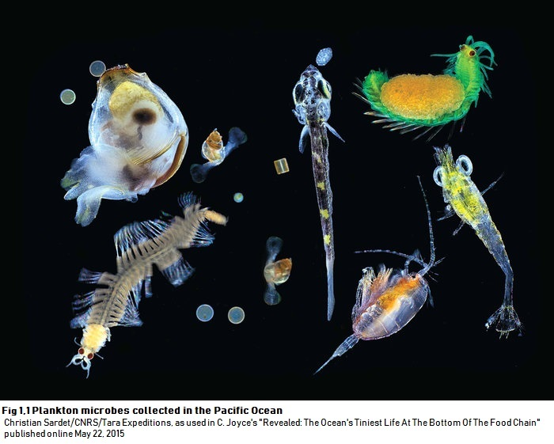

# Microbiome and Beyond

Our earth has always been a home for billions of magnificent species that captivated the eye, including us. Every living thing occupies their respective habitat and evolves with it. But there are more than what is seen with the eyes! An abundant number of tiny organisms--even unseen to the naked eyes--has also been living with us all along. These tiny organisms are called microbes. 

Microbes are single-cell organisms that are approximately 1-5 micrometer in size, consisting of various species of bacteria and fungi (some said that viruses are also included). Although microbes are the smallest forms of life, they live in almost every place on earth, even inside our bodies. They have adapted to thrive in the normal and the most extreme condition on earth. 

 

 

 

 

Microbes live as a community and exchange various chemicals and nutrients that support their own growth and affect the ecosystem around them. For example, the oxygen we breathe in is the result of the past microbial activity of cyanobacteria from around 2.4 billion years ago, which risen the earth's oxygen level and introduced what called as *[the great oxygenation event](http://www.bbc.com/earth/story/20150701-the-origin-of-the-air-we-breathe)*. Recent research also showed that a particular community of microbes lives inside our gut and can perform symbiotic relationships with us. It can secrete chemicals that boost our digestive system, prevent attack by harmful bacteria or viruses, program our immune system, and even direct our appetite, in exchange for a living space. In contrast, a particularly bad community of microbes can also live inside our gut and linked with a higher risk of several disorders including allergies, obesity, diabetes and many types of cancer ([Temraz et al., 2019](https://www.ncbi.nlm.nih.gov/pmc/articles/PMC6747470/)). This specific microbial community that lives in a particular environment is what we called as *microbiome*. The microbiome evolves as the environment evolves. This is why the microbiome has been linked with the 'unseen' force that supports and maintains the earth as well as the biological profile that describes that specific environment. 

Microbiome is often used to describe a specific condition of an environment. From our previous example, the gut microbiome profile can act as a biomarker for a healthy gut or a specific type of disease. The understanding of microbiome is also very powerful for environmental study. This study answers questions such as, 

* What kind of community of microbes lives in a polluted river? What it consist of?
* In what way does each microbes from that community affect the environment they live in?
* Which microbes can act as a biomarker for polluted or unpolluted river? 
* What actions that may recover or worsen the state of polluted river based on its microbial community (by utilizing the knowledge on microbial activity that may affect the environment), and so much more.

The study that focuses on the discovery and the understanding of the microbiome is called Microbiome Analysis. It aims to discover microbial community profiles from a specific environment, understand the community dynamics in various conditions, and provide a clearer understanding of their role in the environment. In practice, this study often results in new findings for biomarkers that can be used to detect specific diseases or conditions in health and environmental studies. Further research may also open the door for the development of personalized diet or treatments! 

 

 

Although microbiome analysis is mainly focused on discovering patterns from a community, it acts as a solid example of how explanatory data analysis can play a huge role in scientific discoveries and initiate further research for the improvement of human lives. In the next section, we will uncover what are the steps that build up a microbiome analysis and what is the idea behind them.
