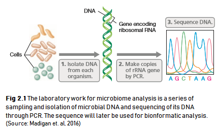

# Microbiome Analysis Workflow

The workflow of microbiome analysis has evolved through out the years. The development of technology and Bioinformatics has made a massive increment on the generation of genomic data that is used for microbiome analysis. Therefore, the use of programming tools such as R and its packages is becoming more widely used. 

If I may put it into 2 major steps, microbiome analysis consist of "Lab Work" and "Bioinformatic Analysis" (**Fig 2.1**). The lab work of a microbiome analysis is quite plenty and mostly technical, which I will not explain it detail in here. Meanwhile, the bioinformatic analysis will be explained in this book with some tutorial. We will be using R languages and its packages as bioinformatics tools.

 

 

## The Lab Work

Every lab work of a microbiome analysis begins by taking a sample of microbial community from either soil, water, swab of a surface, saliva, or any other habitat. The microbes present in that sample will then be filtered and extracted for their DNA. Each microbial DNA will be sequenced to retrieve its genetic code, specifically in the region of a "fingerprint gene" called the *16S ribosomal RNA (16S rRNA)*.

For those of you who are not familiar with cell and molecular biology, these are a brief explanation. DNA is a molecule that harbors genes or sequences of genetic code of a living things. This DNA can be used as a taxonomic marker that differentiate each microbial species from one another. A specific region of DNA called the 16S rRNA gene is usually used for comparation, for this gene exist in all of microbes but has slightly different sequence for each microbes. The difference between each sequence will be calculated to determine how distant or related a microbial species with one another.

## Bioinformatic Analysis

After we have the sequencing result, the bioinformatic analysis can be performed. In brief, this steps aims to compare the sample DNA sequences to the annotated DNA sequences in biological database (ie. [GenBank](https://www.ncbi.nlm.nih.gov/genbank/) or personal database). This is done through alignment of those sequences and the construction of *phylogenetic tree* aka. the tree of life. Unknown DNA sample will be identified based on its most related species from the database, on condition that the DNA similarity reached a certail treshold. 

After all microbes from the community has been identified, we can analyze the community structure and diversity by calculating the abundance of each microbes. We will able to know which microbes dominates over the other, what microbial activities it can do that may affect the environment being studied, etc. This microbial community profile will help us understand the phenomenon happen in a specific environment. We may even discover potential biomarker for industrial application.

From the technical side, the steps of bioinformatic analysis starts from the dirty data cleaning, performing some data pre-processing, followed by applying some algorithms, and finalized by some data visualization and extracting valuable insight. Below is the summary of Bioconductor Workflow for Microbiome Data Analysis adapted from @callahan16. [Bioconductor](https://www.bioconductor.org/) is a repositories of
open source software for Bioinformatics, based on packages written primarily in the R programming language. 

1. Amplicon bioinformatics: Data Cleaning
  i. Trimming and Filtering
  ii. Infer Sequence Variants
  iii. Merge Forward-Reverse DNA Sequences 
  iv. Construct Sequence Table & Remove Chimeras
2. Amplicon Bioinformatics: Phylogenetic Analysis
  i. Assign Taxonomy
  ii. Construct Phylogenetic Tree
  iii. Combine data into Phylosec Object
3. Microbiome analysis: community structure, abundance, and diversity
4. Microbiome analysis: community profile visualization using PCA
5. Microbiome analysis: Supervised learning
6. Microbiome analysis: graph analysis using network visualization

We will discuss deeper for each steps of microbiome analysis and the packages related to it in the following section. A tutorial installing Bioconductor packages also provided in the next section, for it is slightly different than what we usually do when installing packages from [CRAN](https://cran.r-project.org).

