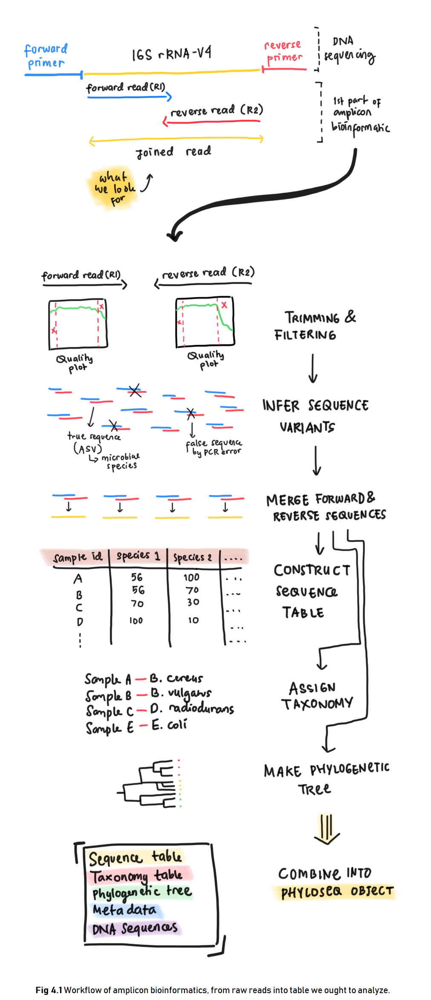
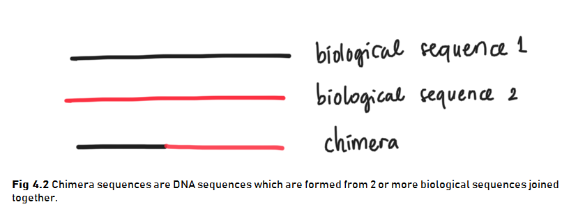

# Amplicon Bioinformatics

This section demonstrates the first step of performing microbiome analysis in R. Amplicon bioinformatics include **construction of the raw reads from sequencing result into the table we ought to analyze**. Below is an illustration of what we are going to do in amplicon bioinformatics (**Fig 4.1**).



## Libraries

First, we should load the necessary packages. You might also want to install some packages if you haven't installed them to your machine.


```r
# CRAN libraries
library(knitr) # for reporting
library(ggplot2) # for graph visualization
library(gridExtra) # additional mapping for ggplot2
library(tidyverse) # for general data cleaning/manipulation

# Bioconductor libraries
library(dada2)
library(phyloseq)
library(Biostrings)
```

We will be using a lot of functions from **DADA2 package** for amplicon analysis and therefore I will be following [DADA2 Pipeline Tutorial (1.12)](https://benjjneb.github.io/dada2/tutorial.html) @dada2pipeline. Through out the tutorial, I will try to explain each step in hopefully a more friendly manner for people who are new to this analysis.

## Dataset


The dataset for microbiome analysis is usually a set of **raw reads of DNA sequences** a.k.a. **amplicons** stored in a digital format as a result of DNA sequencing method performed in labs. The DNA of a microbial species needs to be sequenced first to retrieve its information and store it in a digitalized form. There are various tools for DNA sequencing with the Next Generation Sequencing (NGS) technology being commonly used today. It allows rapid sequencing for a massive load of DNA sequences simultaneously. 

You are free to use your own amplicons dataset while following the tutorial provided in this book. But please do notice that the data should met certain criteria as follows:

1. Samples have been demultiplexed, i.e. each samples have their own DNA sequence (`.fastq` file).
2. Non-biological sequences have been removed, i.e. the samples are free of primers and other artificial sequences from lab work processes.
3. If paired-end sequencing data, the forward and reverse .fastq files contain reads in matched order.

Meanwhile, if you don't have one, you can use the [mothur MiSeq SOP](http://www.mothur.org/wiki/MiSeq_SOP) data provided free in [here](http://mothur.org/w/images/d/d6/MiSeqSOPData.zip/). The data is also used on the original tutorial. 

The data consisted of amplicons from the V4 region of the 16S rRNA gene sequenced through [Illumina Miseq NGS technology](https://sapac.illumina.com/systems/sequencing-platforms/miseq.html?langsel=/id/). The **V4 region** stands for the more specific region of the **16S rRNA gene**. The data contains **DNA from  microbial communities** collected from gut samples of a mouse during post weaning growth (after milk diet). 

The original experiment were done with the aim to understand the effect of normal gut microbiome to the mouse health. The full data is extremely large to process for this introductionary phase (3.9 GB) and therefore we will be using only parts of the data.  With the available data we have, let's try to understand the effect of the first 10 days of post weaning (eating) period to the stability of gut microbiome in the 140-150 day of post weaning period.

These are the steps for reading the data:

1. The data can be downloaded in the link provided above. The data will be in `.zip` format.
2. You will need to extract it to obtain the amplicons in `.fastq` format and some additional files. 

There will be **45 files** consisted of:

* 19 forward reads of community DNA samples
* 19 reverse reads of community DNA samples
* 1 forward reads of control (mock) samples
* 1 reverse reads of control (mock) samples
* 1 HMP_mock.v35 fasta (annotated (named) DNA from mock samples)
* 5 additional information files:
  + mouse.dwp.metadata
  + mouse.time.design
  + stability.batch
  + stability files
  
For those of you who are interested in understanding more about the sample it is a good idea to read the [original research publication](https://www.ncbi.nlm.nih.gov/pmc/articles/PMC3463496/) and perhaps also [articles](https://drive5.com/usearch/manual/otu_qc_controls.html) about designing an experiment including its control.

The DNA samples or amplicons are stored with a standard naming system:

* `F3D0` stands for the mouse id `F3` and the day of sampling `D0`
* the `R1` and `R2` stands for forward and reverse reads respectively. 

Forward and reverse reads came from the sequencing method which sequenced DNA in two direction just as illustrated in **Fig 4.1**. Here is a great [video](https://www.youtube.com/watch?v=ONGdehkB8jU) about DNA sequencing for more detailed process.

Before further analysis, forward and reverse reads of DNA need to be "cleaned" first for its low quality reads and then joined to obtain the full DNA. The data cleaning process is called **Trimming and Filtering** which we will discuss in the next section. Below, the amplicons will be tagged for data cleaning process. 

The amplicons may still be in its compressed format (`.fastq.gz`) but the one we have are not. For those of you who have the compressed format, luckily most bioinformatics tools have the ability to process even the compressed files. This is quite a convenience as most microbiome analysis deals with large-sized data and compressed files are, well, more "compressed". 

The code below will try to list all the amplicons stored in our working directory and separate them between the reverse or forward reads for the data cleaning process. 


```r
# list amplicons into forward/reverse reads
amplicons_F <- sort(list.files(path = "data/MiSeq_SOP", # location of your amplicons
                               pattern = "R1", # forward reads
                               full.names = TRUE))

amplicons_R <- sort(list.files(path = "data/MiSeq_SOP",
                               pattern = "R2", # reverse reads
                               full.names = TRUE))
```


```r
# check the first 6 data
head(amplicons_F) 
```

```
## [1] "data/MiSeq_SOP/F3D0_S188_L001_R1_001.fastq"  
## [2] "data/MiSeq_SOP/F3D1_S189_L001_R1_001.fastq"  
## [3] "data/MiSeq_SOP/F3D141_S207_L001_R1_001.fastq"
## [4] "data/MiSeq_SOP/F3D142_S208_L001_R1_001.fastq"
## [5] "data/MiSeq_SOP/F3D143_S209_L001_R1_001.fastq"
## [6] "data/MiSeq_SOP/F3D144_S210_L001_R1_001.fastq"
```


```r
head(amplicons_R)
```

```
## [1] "data/MiSeq_SOP/F3D0_S188_L001_R2_001.fastq"  
## [2] "data/MiSeq_SOP/F3D1_S189_L001_R2_001.fastq"  
## [3] "data/MiSeq_SOP/F3D141_S207_L001_R2_001.fastq"
## [4] "data/MiSeq_SOP/F3D142_S208_L001_R2_001.fastq"
## [5] "data/MiSeq_SOP/F3D143_S209_L001_R2_001.fastq"
## [6] "data/MiSeq_SOP/F3D144_S210_L001_R2_001.fastq"
```


```r
# extract sample names
sample_names <- basename(amplicons_F) %>% # get file names
  word(start = 1L, sep = "_") # get the first word as the sample names
```


```r
head(sample_names)
```

```
## [1] "F3D0"   "F3D1"   "F3D141" "F3D142" "F3D143" "F3D144"
```

## Trimming & Filtering

After we have separate the sequences into reverse/forward, we need to perform data cleaning by **trimming & filtering**. Raw reads are often have regions with low-quality reads. Most Illumina sequencing data shows a trend of decreasing average quality towards the end of sequencing reads [@callahan16]. 

To know which regions have low quality reads, we can plot it using `plotQualityProfile()` from **DADA2** package. This function plots a visual summary of the distribution of [**quality scores**](https://www.illumina.com/documents/products/technotes/technote_Q-Scores.pdf) for each sequence position. For more clarity, one amplicon files consist of numerous DNA sequences from each microbial present in one community sample. Each sequences calculated for its quality score in each sequence position (first to last). The plot will generate the summary of quality score from all the DNA sequences in one sample.

Let's take the first 3 observation and plot its reverse and forward reads for its quality profile. From there we can determine which position with low quality reads and trim them later.


```r
# plotting 1st observation
f_plot <- plotQualityProfile(amplicons_F[1:3]) + labs(x = "Sequence Position")
r_plot <- plotQualityProfile(amplicons_R[1:3]) + labs(x = "Sequence Position")

grid.arrange(f_plot,r_plot,ncol = 1)
```


The distribution of quality scores at each sequence position is shown as a grey-scale heatmap. The darker color represent higher frequency of each quality score at each sequence position. Notice that I've intentionally changed the x label for easier interpretation. It also shown the quality score summary:

* **green line**: mean quality score
* **orange line-solid**: median quality score
* **orange line-dashed**: 25th and 75th quantiles
* **Reads**: number of reads (DNA sequences present in a sample)
* **red line**: scaled proportion of reads that extend to at least that position (this is more useful for other sequencing technologies, as Illumina reads are typically all the same length, hence resulting a flat red line).

The forward reads are in good quality, but it is still better to trim a few of the first/last position of a sequence to avoid errors that can arise there. In this example, we will trim the first 10 positions because based on empirical observations across many Illumina datasets, the first or last 10 positions are particularly likely to contain pathological errors [@callahan16]. Meanwhile, the reverse reads are more worse in quality, especially at the end. From the plot result, we will trim the last 160 positions from the reverse reads. 

After determining the trimming position for each forward & reverse reads, we will combine it with the standard filtering parameters `maxEE = 2` (the maximum number of expected errors allowed in a read is 2)[@callahan16]. Trimming and filtering is performed on paired reads jointly, i.e. both reads must pass the filter for the pair to pass.

In the code below, we first create a file path for our filtered reads in the working directory and then perform the trimming and filtering.


```r
# creating directory for filtered reads

if(!file_test("-d", "data/filtered")) #"if there is no directory `data/filtered`,
  dir.create("data/filtered") # "create one"

# creating file path
# "data/filtered/sample_names_*_filtered.fastq.gz"

filtered_F <- file.path("data", "filtered", paste0(sample_names,"_F_filtered.fastq.gz"))
filtered_R <- file.path("data", "filtered", paste0(sample_names,"_R_filtered.fastq.gz"))
```


```r
# check the file path
head(filtered_F, 3)
```

```
## [1] "data/filtered/F3D0_F_filtered.fastq.gz"  
## [2] "data/filtered/F3D1_F_filtered.fastq.gz"  
## [3] "data/filtered/F3D141_F_filtered.fastq.gz"
```


```r
# trimming & filtering

tnf_summary <- filterAndTrim(amplicons_F, filtered_F, # input and output
                             amplicons_R, filtered_R,
                     
                             # trimming
                             trimLeft=10, # trim the first n observation from each reads
                             truncLen=c(240,160), # truncate reads after this position; c(Forward/Reverse)
                             
                             # filtering standard
                             maxN=0, maxEE=c(2,2), # max expected error (maxEE) = 2
                             truncQ=2, rm.phix=TRUE,
                             
                             # additional setting
                             compress=TRUE, # whether outputs should be compressed
                             multithread=FALSE) # default for Windows, Mac can use `multithread=TRUE`
```


```r
tnf_summary
```

```
##                               reads.in reads.out
## F3D0_S188_L001_R1_001.fastq       7793      7139
## F3D1_S189_L001_R1_001.fastq       5869      5314
## F3D141_S207_L001_R1_001.fastq     5958      5478
## F3D142_S208_L001_R1_001.fastq     3183      2926
## F3D143_S209_L001_R1_001.fastq     3178      2955
## F3D144_S210_L001_R1_001.fastq     4827      4323
## F3D145_S211_L001_R1_001.fastq     7377      6762
## F3D146_S212_L001_R1_001.fastq     5021      4580
## F3D147_S213_L001_R1_001.fastq    17070     15695
## F3D148_S214_L001_R1_001.fastq    12405     11448
## F3D149_S215_L001_R1_001.fastq    13083     12064
## F3D150_S216_L001_R1_001.fastq     5509      5054
## F3D2_S190_L001_R1_001.fastq      19620     18130
## F3D3_S191_L001_R1_001.fastq       6758      6275
## F3D5_S193_L001_R1_001.fastq       4448      4068
## F3D6_S194_L001_R1_001.fastq       7989      7394
## F3D7_S195_L001_R1_001.fastq       5129      4772
## F3D8_S196_L001_R1_001.fastq       5294      4890
## F3D9_S197_L001_R1_001.fastq       7070      6525
## Mock_S280_L001_R1_001.fastq       4779      4333
```

Wait for a while as your machine processing your request to trim and filter the amplicons. When it is done, the resulting amplicons will be located in the `filtered_path` you have stated earlier. You can track the number of in-and-out filtered reads for each sample in `tnf_summary`.

## Infer Sequence Variants

After filtering, typical workflow will continue to perform **clustering** of the DNA sequences into **Operational Taxonomic Units (OTUs)** or the estimated distinct species present in the community. This is performed by creating groups of sequencing reads that differ by less than a fixed dissimilarity threshhold. Even so, there is still a possibility of sequencing errors generating artificial sequences. To tackle this problem, a high-throughput **DADA2** method was developed. This method can infer **amplicon sequence variants (ASVs)** from our amplicons data. ASVs are individual DNA sequences recovered after the removal of false sequences generated from error during PCR amplification and sequencing. ASVs are considered as **the true biological sequences** and therefore will be used for further analysis.

DADA2 works by making use of a **parametric error model** `err` to distinguish between true biological sequences (ASVs) and those generated by error @callahan16. This error model learns the maximum possible error rates of our amplicons data using the `learnErrors()` function [@dada2pipeline]. The error model will later be used in the DADA2 algorithm using `dada()` function.


```r
# error model for forward reads
error_F <- learnErrors(filtered_F) #input: file path for filtered reads
```


```r
# error model for reverse reads
error_R <- learnErrors(filtered_R)
```


```r
# infer sequence variants
dada_F <- dada(filtered_F, err = error_F, verbose = FALSE) 
dada_R <- dada(filtered_R, err = error_R, verbose = FALSE)
```

Let's check dada2 result from the first sample forward reads. Dada infer 130 true amplicon sequence variants from 1866 unique sequences.


```r
dada_F[1]
```

```
## $F3D0_F_filtered.fastq.gz
## dada-class: object describing DADA2 denoising results
## 130 sequence variants were inferred from 1866 input unique sequences.
## Key parameters: OMEGA_A = 1e-40, OMEGA_C = 1e-40, BAND_SIZE = 16
```

## Merge Forward & Reverse Reads

The DADA2 algorithm removed (nearly) all substitution errors from the data and the data are now ready to be merged. 
 

```r
merged <- mergePairs(dadaF = dada_F, # dada result
                     derepF = filtered_F, # path of filtered reads
                     dadaR = dada_R,
                     derepR = filtered_R)
```

## Construct Sequence Table & Remove Chimeras

Using the merged pairs of the amplicon data, a sequence table or in this case an **amplicon sequence variant (ASV) table** can be generated. This table is in `matrix` format with rows stores the **sample names** and the columns stores the **number of each ASVs**. From this table we can inspect the number of ASVs (representing each microbial species) in each sample. ASV table is a higher-resolution version of the OTU table produced by tradisional method. 

We can construct a sequence table using `makeSequenceTable()`.


```r
seqtab <- makeSequenceTable(merged)
```

Below is a glimpse of what our `seqtab` matrix looks like:


```r
# first 3 observation; first 3 ASV (named by its DNA sequence)
seqtab[1:3,1:3]
```

```
##        GCGAGCGTTATCCGGATTTATTGGGTTTAAAGGGTGCGCAGGCGGAAGATCAAGTCAGCGGTAAAATTGAGAGGCTCAACCTCTTCGAGCCGTTGAAACTGGTTTTCTTGAGTGAGCGAGAAGTATGCGGAATGCGTGGTGTAGCGGTGAAATGCATAGATATCACGCAGAACTCCGATTGCGAAGGCAGCATACCGGCGCTCAACTGACGCTCATGCACGAAAGTGTGGGT
## F3D0                                                                                                                                                                                                                                        582
## F3D1                                                                                                                                                                                                                                        417
## F3D141                                                                                                                                                                                                                                      442
##        GCGAGCGTTATCCGGATTTATTGGGTTTAAAGGGTGCGCAGGCGGACTCTCAAGTCAGCGGTCAAATCGCGGGGCTCAACCCCGTTCCGCCGTTGAAACTGGGAGCCTTGAGTGCGCGAGAAGTAGGCGGAATGCGTGGTGTAGCGGTGAAATGCATAGATATCACGCAGAACTCCGATTGCGAAGGCAGCCTACCGGCGCGCAACTGACGCTCATGCACGAAAGCGTGGGT
## F3D0                                                                                                                                                                                                                                        345
## F3D1                                                                                                                                                                                                                                        354
## F3D141                                                                                                                                                                                                                                      363
##        GCGAGCGTTATCCGGATTTATTGGGTTTAAAGGGTGCGTAGGCGGGCTGTTAAGTCAGCGGTCAAATGTCGGGGCTCAACCCCGGCCTGCCGTTGAAACTGGCGGCCTCGAGTGGGCGAGAAGTATGCGGAATGCGTGGTGTAGCGGTGAAATGCATAGATATCACGCAGAACTCCGATTGCGAAGGCAGCATACCGGCGCCCGACTGACGCTGAGGCACGAAAGCGTGGGT
## F3D0                                                                                                                                                                                                                                        451
## F3D1                                                                                                                                                                                                                                        232
## F3D141                                                                                                                                                                                                                                      347
```

We have three ASVs (sequences) and its number on each of our first three samples. For more tidy visualization, we can change the simplify the sample names:


```r
rownames(seqtab) <- sample_names
```


```r
dim(seqtab)
```

```
## [1]  20 286
```

We have a total of maximum 286 ASVs or expected microbial species that may present in a community sample.

The last data cleaning step that we can do is to remove chimeras. **Chimeras** are DNA sequences which are formed from 2 or more biological sequences joined together (**Fig 4.2**). These chimeras can act as distinct microbial species alone when in fact it is not a true microbial sequences.



Chimeras can be identified if they can be exactly reconstructed by combining a left-segment and a right-segment from two more abundant "parent" or biological sequences. We can remove chimeras using function `removeBimeraDenovo()`.


```r
seqtab_nochim <- removeBimeraDenovo(seqtab,
                                    method = "consensus")
```

```r
dim(seqtab_nochim)
```

```
## [1]  20 234
```

Removing chimeras leave us with 234 ASVs from the original 286 ASVs we previously have. Even so, if you calculate the percentage of chimeric sequences from the total abundance of all sequences, it only accounts for 4% of the data. This amount is small and acceptable. On the other hand, if your analysis indicates a lot of chimeric sequences there might be some upstream processes that have gone wrong such as not removing the primer sequences from the fasta prior to reading the data @dada2pipeline. 

You can track the number of reads or sequences that made it through each step of the processes. 


```r
# create function to get the sum of unique DNA

getN <- function(x) {
  sum(getUniques(x))
}

# generate the summary
track_reads <- data.frame(row.names = sample_names,
           raw_reads = tnf_summary[,1],
           filtered = tnf_summary[,2],
           ASVs_F = sapply(dada_F, getN), # sapply to apply the function to all rows (sample)
           ASVs_R = sapply(dada_F, getN),
           joined = sapply(merged, getN),
           no_chimera = rowSums(seqtab_nochim)) # form row-column sums
```


```r
track_reads
```

```
##        raw_reads filtered ASVs_F ASVs_R joined no_chimera
## F3D0        7793     7139   7021   7021   6667       6655
## F3D1        5869     5314   5252   5252   5028       5028
## F3D141      5958     5478   5369   5369   4995       4867
## F3D142      3183     2926   2822   2822   2611       2546
## F3D143      3178     2955   2837   2837   2598       2564
## F3D144      4827     4323   4175   4175   3690       3540
## F3D145      7377     6762   6622   6622   6150       5873
## F3D146      5021     4580   4456   4456   4003       3901
## F3D147     17070    15695  15505  15505  14080      12980
## F3D148     12405    11448  11283  11283  10567      10027
## F3D149     13083    12064  11917  11917  11166      10705
## F3D150      5509     5054   4897   4897   4392       4306
## F3D2       19620    18130  17977  17977  17520      16952
## F3D3        6758     6275   6179   6179   5911       5611
## F3D5        4448     4068   3932   3932   3723       3723
## F3D6        7989     7394   7268   7268   6904       6716
## F3D7        5129     4772   4657   4657   4435       4222
## F3D8        5294     4890   4806   4806   4583       4553
## F3D9        7070     6525   6397   6397   6154       6075
## Mock        4779     4333   4309   4309   4292       4292
```

From the summary, we know that there is no over-large drop associated with any single step and we manage to keep majority of our data. Now we can move to the next step.

## Assign Taxonomy

Previous amplicon bioinformatics processes provide us with a sequence table containing the number of distinct amplicons (ASVs) which resembles a microbial species in each of our sample. This table will be more informative and easier to analyze when we have **assign the taxonomy or identity for each ASVs** in the table. That is like giving an identity to the considerably long ACGT-code in the into something more "readable" for the column names.

Assigning taxonomy is a process of classifiying an unknown ASVs into a known microbial species. Using DADA2 package, it involves a native implementation of the *naive Bayesian classifier method*. The function `assignTaxonomy()` will take an input of a set of sequences to be classified (**ASVs**) a nd a **training set of reference sequences** with known taxonomy. The function will output taxonomic assinments for all ASVs with at least `minBoot` bootstrap confidence (parameter for the algorithm). Do it looks like a **machine learning classification case**? Yes, it is.

There are [various resources](https://benjjneb.github.io/dada2/training.html) for training set fastas, but I will use **the Silva reference database** [@michael_silva] for this example. To use it, go to [this link]((https://zenodo.org/record/3731176#.Xp68_8gzbIU)) and download these files: 

* silva_nr_v138_train_set.fa.gz 
* silva_species_assignment_v138.fa.gz

and then place the files inside the same directory with our filtered sequences `.fastq.gz` files. We can then perform taxonomy assignment:


```r
# assign taxa until genus level
  taxa <- assignTaxonomy(seqtab_nochim, # sequence table
                       refFasta = "data/filtered/silva_nr_v138_train_set.fa.gz", # reference sequence
                       minBoot = 50) # minimal bootstrap confidence; default to 50

# add taxa until species level
# note that it may result NA if there is no exact match in the reference
taxa <- addSpecies(taxa, # result from assignTaxonomy
                   refFasta = "data/filtered/silva_species_assignment_v138.fa.gz")
```


```r
# check taxonomic assignment
taxa_print <- taxa
rownames(taxa_print) <- NULL # for visualization purpose
```


```r
head(taxa_print)  
```

```
##      Kingdom    Phylum         Class         Order           Family          
## [1,] "Bacteria" "Bacteroidota" "Bacteroidia" "Bacteroidales" "Muribaculaceae"
## [2,] "Bacteria" "Bacteroidota" "Bacteroidia" "Bacteroidales" "Muribaculaceae"
## [3,] "Bacteria" "Bacteroidota" "Bacteroidia" "Bacteroidales" "Muribaculaceae"
## [4,] "Bacteria" "Bacteroidota" "Bacteroidia" "Bacteroidales" "Muribaculaceae"
## [5,] "Bacteria" "Bacteroidota" "Bacteroidia" "Bacteroidales" "Bacteroidaceae"
## [6,] "Bacteria" "Bacteroidota" "Bacteroidia" "Bacteroidales" "Muribaculaceae"
##      Genus         Species
## [1,] NA            NA     
## [2,] NA            NA     
## [3,] NA            NA     
## [4,] NA            NA     
## [5,] "Bacteroides" NA     
## [6,] NA            NA
```

For those of you who were more exposed to the manual approach of assigning taxonomy (using *clustering*)--like me in my university years, you must be quite confused with this new classification approach. In the manual approach, for each unknown species, we perform **clustering** of unknown DNA with the reference database and perform taxonomy assignment based on the highest DNA sequence similarity. DADA2 approach is rather different. But using this new algorithm to perform massive taxonomy assignments on numerous unknown species simultaneously is considered a common approach now. Personally, I captured this as a solid movement towards the rising of **Big Data** era in Biology, just like the data we use in this book.

In this point, youu can additionally check the accuracy of DADA2 algorithm in inferring sequence variants by comparing the result of mock samples to the annotated sequence of mock samples `HMP_mock.v35 fasta`. I'll leave it for you to explore the original documentation [here](https://benjjneb.github.io/dada2/tutorial.html).

## Create Phyloseq Object

After many process of amplicon bioinformatics, the last thing we can do is to combine all the processed data into a **phyloseq object**. A phyloseq object will be in a `.csv` format which will be easier for us to manipulate for microbiome analysis. We can create a phylosec object by combining several metadata and the result of our DADA2 process.

We will use the sample names which stores the information. Keep in mind that we have to pay attention to where is the mock sample is located for it has different naming system and therefore needs special treatments.


```r
sample_names
```

```
##  [1] "F3D0"   "F3D1"   "F3D141" "F3D142" "F3D143" "F3D144" "F3D145" "F3D146"
##  [9] "F3D147" "F3D148" "F3D149" "F3D150" "F3D2"   "F3D3"   "F3D5"   "F3D6"  
## [17] "F3D7"   "F3D8"   "F3D9"   "Mock"
```

Below we will extract the information one by one:


```r
gender <- substr(sample_names, start = 1, stop = 1) # get the first character
gender
```

```
##  [1] "F" "F" "F" "F" "F" "F" "F" "F" "F" "F" "F" "F" "F" "F" "F" "F" "F" "F" "F"
## [20] "M"
```


```r
subject <- substr(sample_names, 2, 2) # get the second character
subject
```

```
##  [1] "3" "3" "3" "3" "3" "3" "3" "3" "3" "3" "3" "3" "3" "3" "3" "3" "3" "3" "3"
## [20] "o"
```

```r
day <- sapply(strsplit(sample_names, "D"), `[`, 2) %>% # separate by 'D'; get the 2nd value [2]
       as.integer() # convert to integer
day
```

```
##  [1]   0   1 141 142 143 144 145 146 147 148 149 150   2   3   5   6   7   8   9
## [20]  NA
```


```r
# combine metadata
seq_data <- data.frame(Subject = subject, 
                    Gender = gender, 
                    Day = day,
                    When = ifelse(day < 100, "Early", "Late"), # add early/late sampling period
                    row.names = sample_names)
head(seq_data)
```

```
##        Subject Gender Day  When
## F3D0         3      F   0 Early
## F3D1         3      F   1 Early
## F3D141       3      F 141  Late
## F3D142       3      F 142  Late
## F3D143       3      F 143  Late
## F3D144       3      F 144  Late
```

Now let's create a phylosec object:


```r
# create phylosec object
ps <- phyloseq(otu_table(seqtab_nochim, taxa_are_rows=FALSE),
               sample_data(seq_data),
               tax_table(taxa))

# remove mock sample
ps <- prune_samples(sample_names(ps) != "Mock", ps)
```


```r
ps
```

```
## phyloseq-class experiment-level object
## otu_table()   OTU Table:         [ 234 taxa and 19 samples ]
## sample_data() Sample Data:       [ 19 samples by 4 sample variables ]
## tax_table()   Taxonomy Table:    [ 234 taxa by 7 taxonomic ranks ]
## refseq()      DNAStringSet:      [ 234 reference sequences ]
```

It is also better to merge the sequences of our ASVs in the phyloseq object. We will use function from **Biostrings** package to extract sequences from ASV table. The sequences are stored as taxa names in ASVs table (labelled as OTU table).


```r
# get sequences
dna <- Biostrings::DNAStringSet(taxa_names(ps))
names(dna) <- taxa_names(ps) # connect dna data to taxa names
```

```r
dna
```

```
##   A DNAStringSet instance of length 234
##       width seq                                             names               
##   [1]   232 GCGAGCGTTATCCGGATTTATT...GCTCATGCACGAAAGTGTGGGT GCGAGCGTTATCCGGAT...
##   [2]   232 GCGAGCGTTATCCGGATTTATT...GCTCATGCACGAAAGCGTGGGT GCGAGCGTTATCCGGAT...
##   [3]   232 GCGAGCGTTATCCGGATTTATT...GCTGAGGCACGAAAGCGTGGGT GCGAGCGTTATCCGGAT...
##   [4]   232 GCGAGCGTTATCCGGATTTATT...GCTGAGGCACGAAAGTGCGGGG GCGAGCGTTATCCGGAT...
##   [5]   233 CCGAGCGTTATCCGGATTTATT...ACTGATGCTCGAAAGTGTGGGT CCGAGCGTTATCCGGAT...
##   ...   ... ...
## [230]   233 GCAAGCGTTATCCGGAATGACT...ACTGAGGCACGAAAGCGTGGGG GCAAGCGTTATCCGGAA...
## [231]   233 GCGAGCGTTATCCGGATTTATT...GTTGAGGCACGAAAGTGTGGGG GCGAGCGTTATCCGGAT...
## [232]   232 GCGAGCGTTATCCGGATTCATT...GCTGAGGCGCGAAAGCTGGGGG GCGAGCGTTATCCGGAT...
## [233]   232 GCGAGCGTTATCCGGATTCATT...GCTGAGGCGCGAAAGCTAGGGG GCGAGCGTTATCCGGAT...
## [234]   232 GCGAGCGTTATCCGGATTTATT...GCTGAGGCACGAAAGCGTGGGG GCGAGCGTTATCCGGAT...
```


```r
# merge data
ps <- merge_phyloseq(ps, dna)

# change taxa names into shorter id (ASVn)
taxa_names(ps) <- paste0("ASV", seq(ntaxa(ps)))
```

Now, we can easily retrieve DNA sequences for each ASVs using taxa names as key id. 


```r
# first three ASVs in our samples
otu_table(ps)[,1:3]
```

```
## OTU Table:          [3 taxa and 19 samples]
##                      taxa are columns
##        ASV1 ASV2 ASV3
## F3D0    582  345  451
## F3D1    417  354  232
## F3D141  442  363  347
## F3D142  290  305  159
## F3D143  231  176  204
## F3D144  424  277  304
## F3D145  647  494  523
## F3D146  326  231  254
## F3D147 1499 1220  913
## F3D148  870  732  580
## F3D149  887  781  725
## F3D150  318  232  402
## F3D2   3509 1594 1179
## F3D3    998  606  469
## F3D5    322  265  284
## F3D6   1017  675  590
## F3D7    649  504  439
## F3D8    277  356  352
## F3D9    512  426  485
```

```r
# first 3 ASVs sequences
refseq(ps)[1:3]
```

```
##   A DNAStringSet instance of length 3
##     width seq                                               names               
## [1]   232 GCGAGCGTTATCCGGATTTATTG...CGCTCATGCACGAAAGTGTGGGT ASV1
## [2]   232 GCGAGCGTTATCCGGATTTATTG...CGCTCATGCACGAAAGCGTGGGT ASV2
## [3]   232 GCGAGCGTTATCCGGATTTATTG...CGCTGAGGCACGAAAGCGTGGGT ASV3
```

We finally have our final phyloseq object containing **ASVs table**, our sample metadata, taxonomy table for our ASVs, and its DNA sequences.


```r
ps
```

```
## phyloseq-class experiment-level object
## otu_table()   OTU Table:         [ 234 taxa and 19 samples ]
## sample_data() Sample Data:       [ 19 samples by 4 sample variables ]
## tax_table()   Taxonomy Table:    [ 234 taxa by 7 taxonomic ranks ]
## refseq()      DNAStringSet:      [ 234 reference sequences ]
```

After creating the phylosec object, we are ready to dive deeper into microbiome analysis in the next chapter!
