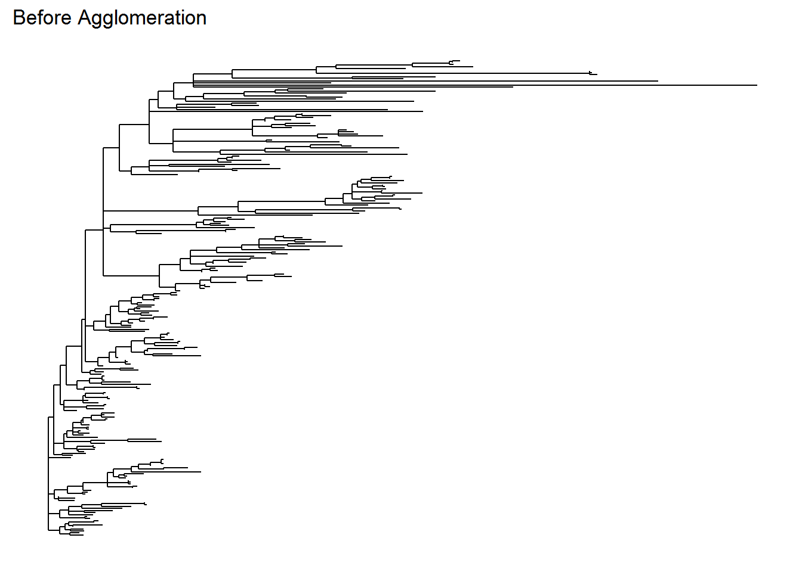
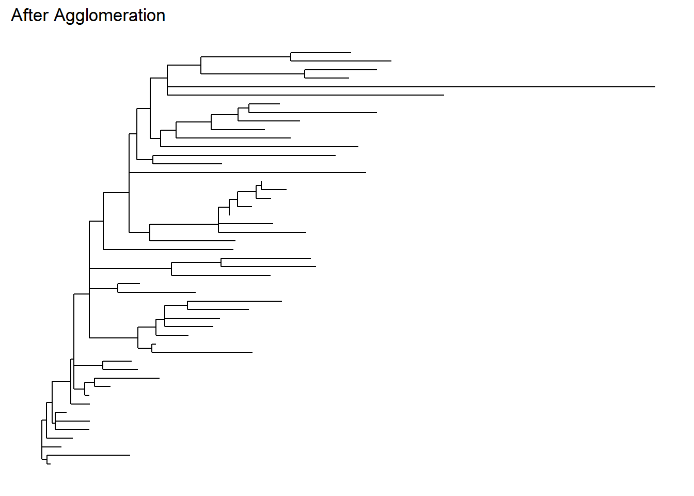

# Phyloseq Object Processing


Microbiome analysis comes with many challenging tasks. It involves the integration of various types of data with methods from ecology, genetics, network analysis and visualization. The data itself may originate from widely different sources such as humans, animals, samples from environment including industrial and public facilities. This variety result in data with various forms and scales, making the data processing steps extremely dependent upon the experiment and its question(s).

The phyloseq package offers tools to import, store, analyze and graphically display complex phylogenetic sequencing data. It leverages many packages available in R for ecology and phylogenetic analysis (vegan, ade4, ape, picante) while also using flexible graphic system for visualization using ggplot2 package  @joey711. 

Phyloseq accepts many forms of microbiome data, including QIIME format. But in this tutorial, following the previous step, we will use **the phyloseq object** `ps` we have made earlier. It already contains our sequence table and its supplementary data. 

We are going to perform several data pre-processing:

* Filtering: Taxonomic Filtering
* Agglomerate Taxa


```r
# load phyloseq object `ps` if you haven't
# ps <- readRDS("assets/05/ps.rds")
```

## Filtering

One of the reasons to filter microbiome data is to avoid spending much time analyzing taxa that were seen only rarely among samples. There are two kinds of filtering, taxonomic and prevalence filtering.

In this example, we will use the *taxonomic filtering* that is quite supervised and relies on taxonomic assignment (it is supervised because it relies on taxonomic reference database). Even so, if you are quite curious about the later one, you can read the more detailed tutorial in [here](https://f1000research.com/articles/5-1492/v2). 

In brief, *prevalence filtering* is the type of filtering that is more unsupervised. It relies on the relationship between prevalence of taxa and total abundance of each samples, hoping that the pattern reveals outliers that should probably be removed. This filtering is most applicable when taxonomic annotation is unavailable or unreliable.

In most biological settings, the organisms present in all samples are well-represented in the available taxonomic reference database. With this assumption, it is advisable to filter organisms which its high-rank taxonomy could not be assigned. Thise organism (sequence) are almost always **sequence artifacts** that don’t exist in nature. For this, *Phylum* is a useful taxonomic for filtering, although other options are possible for your own research.


```r
# possible taxonomic rank
rank_names(ps)
```

```
## [1] "Kingdom" "Phylum"  "Class"   "Order"   "Family"  "Genus"   "Species"
```

In our `ps` data, we have a `tax_table` which stores taxonomic assignment for each of our 234 ASVs (organisms), stored in matrix format. We can access that through `tax_table()` and ensure its dimension.


```r
# rows - column: 234 ASVs - 7 Taxonomic Rank 
dim(tax_table(ps))
```

```
## [1] 234   7
```

Now, let's calculate the number of organisms present for each Phylum.


```r
table(tax_table(ps)[,"Phylum"])
```

```
## 
##  Actinobacteriota      Bacteroidota  Campilobacterota     Cyanobacteria 
##                 7                20                 1                 3 
##      Deinococcota        Firmicutes   Patescibacteria    Proteobacteria 
##                 1               193                 1                 7 
## Verrucomicrobiota 
##                 1
```

Based on the table above there is no <NA> that indicates a sequece artifacts. We can go on to the next step.

## Agglomerate Taxa

When there is known to be a lot of species or sub-species redundancy in a microbial community, it might be useful to agglomerate or if I say "bundle" the data (taxonomy) into the closely related taxa. 

While not necessarily the most useful or functionally-accurate criteria for grouping microbial features (sometimes far from accurate), taxonomic agglomeration has the advantage of being much easier to define ahead of time @callahan16. 

The following code shows how we would "bundle" all organisms descend from the same genus.


```r
# available genus: 49 (not including NA) 
get_taxa_unique(ps, taxonomic.rank = "Genus")
```

```
##  [1] NA                              "Bacteroides"                  
##  [3] "Alistipes"                     "Lactobacillus"                
##  [5] "Turicibacter"                  "Lachnospiraceae_NK4A136_group"
##  [7] "Oscillibacter"                 "Eisenbergiella"               
##  [9] "Staphylococcus"                "A2"                           
## [11] "Acinetobacter"                 "Roseburia"                    
## [13] "Lachnoclostridium"             "Bacillus"                     
## [15] "Incertae_Sedis"                "Lachnospiraceae_UCG-001"      
## [17] "Helicobacter"                  "Anaeroplasma"                 
## [19] "Actinomyces"                   "Clostridium_sensu_stricto_1"  
## [21] "Neisseria"                     "Bifidobacterium"              
## [23] "Acetatifactor"                 "Lachnospiraceae_UCG-004"      
## [25] "Streptococcus"                 "Lachnospiraceae_FCS020_group" 
## [27] "Escherichia/Shigella"          "Candidatus_Saccharimonas"     
## [29] "Enterococcus"                  "Colidextribacter"             
## [31] "Anaerotruncus"                 "Listeria"                     
## [33] "Lachnospiraceae_UCG-006"       "Pseudomonas"                  
## [35] "Deinococcus"                   "Porphyromonas"                
## [37] "Herbinix"                      "ASF356"                       
## [39] "GCA-900066575"                 "Rhodobacter"                  
## [41] "Family_XIII_UCG-001"           "Enterorhabdus"                
## [43] "Tyzzerella"                    "Intestinimonas"               
## [45] "Butyricicoccus"                "Akkermansia"                  
## [47] "Candidatus_Arthromitus"        "UCG-005"                      
## [49] "Lachnospiraceae_NK4B4_group"   "Olsenella"
```

```r
# agglomerate taxa
ps_agg <- tax_glom(ps, "Genus", NArm = TRUE) 
```

Note that the parameter `NArm = TRUE` removes unassigned sequence on Genus. But be caution of this! This choice is very dependent on your research case and can really affect the downstream or following analysis. 

Below is our original and agglomerated data and their phylogenetic tree. Note that the tree from the agglomerated data is more simpler and will be much more easier to interpret later (if we need one for phylogenetic analysis, although we will not discuss much in this tutorial). I personally think that the taxonomy rank "Genus" is decent enough to identify an originally unknown microbial species. 


```r
# original data
ps
```

```
## phyloseq-class experiment-level object
## otu_table()   OTU Table:         [ 234 taxa and 19 samples ]
## sample_data() Sample Data:       [ 19 samples by 4 sample variables ]
## tax_table()   Taxonomy Table:    [ 234 taxa by 7 taxonomic ranks ]
## phy_tree()    Phylogenetic Tree: [ 234 tips and 232 internal nodes ]
## refseq()      DNAStringSet:      [ 234 reference sequences ]
```


```r
# agglomerated data
ps_agg
```

```
## phyloseq-class experiment-level object
## otu_table()   OTU Table:         [ 49 taxa and 19 samples ]
## sample_data() Sample Data:       [ 19 samples by 4 sample variables ]
## tax_table()   Taxonomy Table:    [ 49 taxa by 7 taxonomic ranks ]
## phy_tree()    Phylogenetic Tree: [ 49 tips and 48 internal nodes ]
## refseq()      DNAStringSet:      [ 49 reference sequences ]
```


```r
ps_tree <-  plot_tree(ps, method = "treeonly",
                   ladderize = "left",
                   title = "Before Agglomeration")

ps_agg_tree <-  plot_tree(ps_agg, method = "treeonly",
                   ladderize = "left",
                   title = "After Agglomeration")
```


```r
ps_tree
```



```r
ps_agg_tree
```



We have completely perform data pre-processing. Let's use this pre-processed data into further exploratory data analysis using plots and multivariate projections method such as PCoA.
