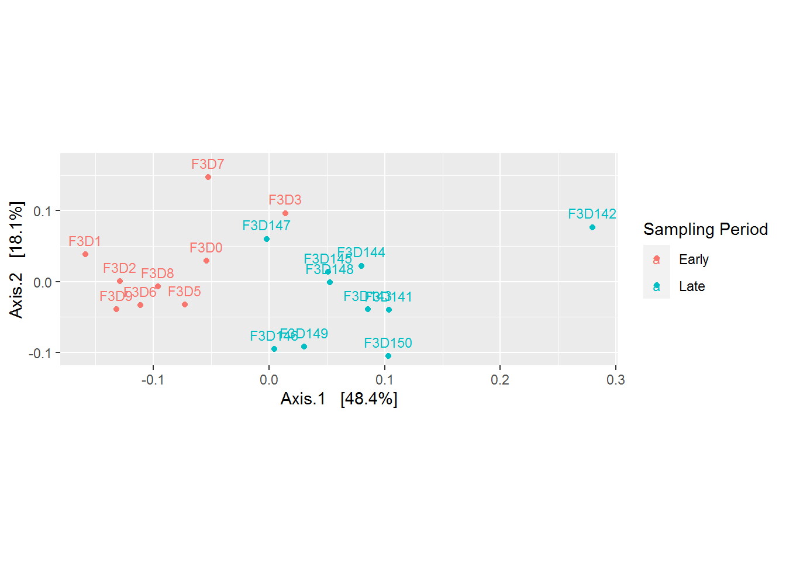
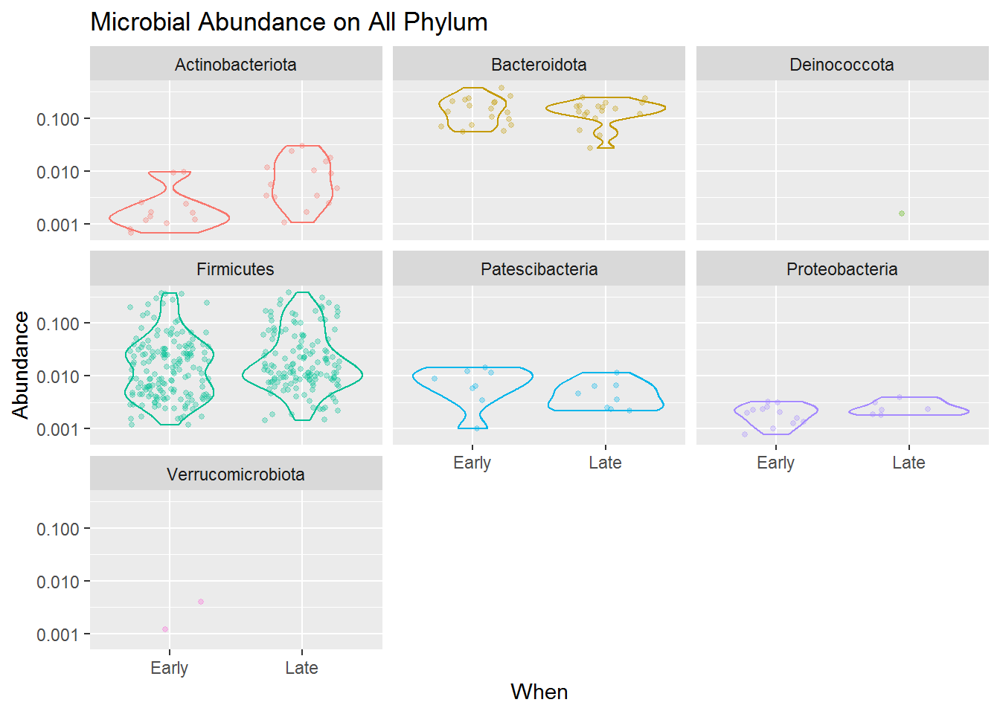
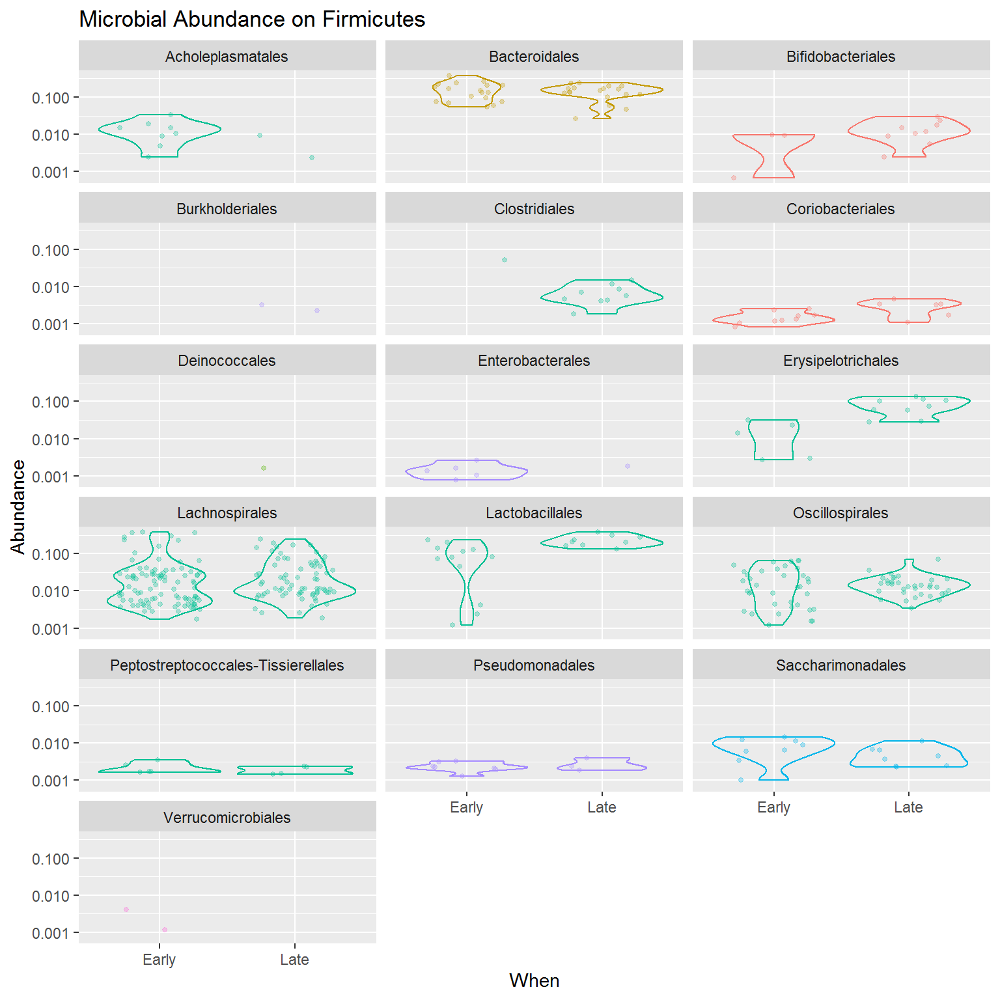
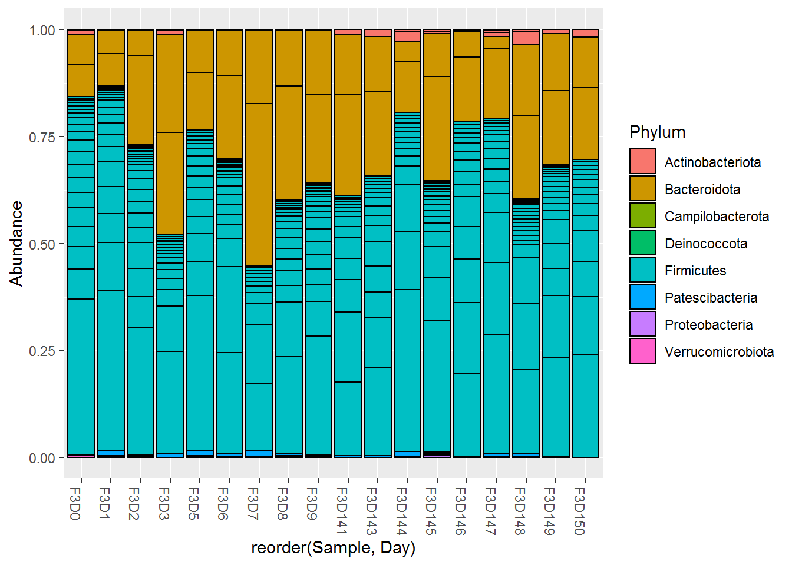

# Microbiome Analysis


Exploratory Data Analysis is perhaps the most insightful step we can do during microbiome analysis. It usually aims to discover patterns that may best distinguish and explain the data. Exploratory Data Analysis utilize visualization of the data by using common plots and multivariate projections such as PCoA.

## Multivariate Projection

The first explanatory data analysis we will do is to perform multivariate projection of our sample data. This is to **discover pattern that might best distinguish our data** and use it for further analysis. 

Before visualization, it is common to normalize our data. We can use `transform_sample_counts()` to define our specific function. In this example, we will log-transform our original abundance data as an approximate variance stabilizing transformation @callahan16. We will use column `When` from sample data to annotate plots.


```r
# log-transform data
ps_log <- transform_sample_counts(ps_agg, function(x) log(1 + x))
```


```r
# making ordinate
out_wuf_log <- ordinate(ps_log, 
                        method = "MDS", # for PCoA 
                        distance = "wunifrac") # weighted Unifrac distance
# prepare eigen values to adjust axis
evals <- out_wuf_log$values$Eigenvalues
```


```r
plot_pcoa<- plot_ordination(ps_log, out_wuf_log, color = "When") +
  geom_text(aes(label = sample_names(ps_log)), size = 3, nudge_y = 0.02) +
  labs(col = "Sampling Period") +
  # to adjust axis length based on eigen values (variance it contains)
  coord_fixed(sqrt(evals[2] / evals[1])) 
```


```r
plot_pcoa
```



Based on the plot above, it is becoming more clear that there is a difference between microbial community came from the early and late sampling period. Refering back to our research question, *"the mice gut microbiome on the 10 days of post weaning (eating) period did encounter a shift/changes when we compared it to its late period"*. But what are the changes? This can be explored more by plotting microbial abundance of our samples.

Besides discovering patterns, PCoA plot also useful for telling us whether there are **outliers** in our data. From the plot above, the sample *F3D142* seems to be an outlier. We can remove the data before further analysis. 


```r
ps_cut <- prune_samples(sample_names(ps_agg) != "F3D142", ps_agg)
```

## Microbial Abundandce

The next explanatory data analysis we will do is to check the microbial abundance within each sample (microbial sequence count per sample). Before visualization, it is common to normalize our abundance data. Same as before, we can use `transform_sample_counts()` to define our specific function. In this example, we will converts the microbial count stored in the `ps_cut` into frequencies per total count for each sample a.k.a *proportions* or *relative abundance*.


```r
ps_relav <- transform_sample_counts(ps_cut, 
                                    function(x){x / sum(x)})
```

Here's our abundance data before and after transformation:


```r
# before transformation
ps_cut@otu_table[1:6, 1:3]
```

```
## OTU Table:          [3 taxa and 6 samples]
##                      taxa are columns
##        ASV5 ASV8 ASV11
## F3D0    173  185   111
## F3D1    140  191   284
## F3D141  190  324   225
## F3D143  130   84   134
## F3D144  105   41   332
## F3D145  308  126   388
```

```r
# inspect data after
ps_relav@otu_table[1:6, 1:3]
```

```
## OTU Table:          [3 taxa and 6 samples]
##                      taxa are columns
##              ASV5       ASV8      ASV11
## F3D0   0.06995552 0.07480793 0.04488476
## F3D1   0.05513982 0.07522647 0.11185506
## F3D141 0.13868613 0.23649635 0.16423358
## F3D143 0.19877676 0.12844037 0.20489297
## F3D144 0.11972634 0.04675029 0.37856328
## F3D145 0.24463860 0.10007943 0.30818110
```

In plotting microbial abundance it is best to follow our original research question, something that we really want to analyze. Like before, let's plot the microbial abundance per sampling period. This information can support our analysis on our research question:

> We want to understand the effect of the first 10 days of post weaning (eating) period to the stability of gut microbiome in the 140-150 day of post weaning period.

Now let's plot our microbial abundace data using a DIY function. The function will result in **microbial abundance** per **taxonomical rank** we provided for each **categorical features** we ought to analyze. 

Here are a list of Phylum taxonomical rank that we can analyze from the sample:


```r
# convert to data frame for easier access
tax_table <- as.data.frame(ps_relav@tax_table@.Data)
```


```r
# phylum
unique(tax_table$Phylum)
```

```
## [1] "Bacteroidota"      "Firmicutes"        "Proteobacteria"   
## [4] "Campilobacterota"  "Actinobacteriota"  "Patescibacteria"  
## [7] "Deinococcota"      "Verrucomicrobiota"
```

Note that in this tutorial, we only have the categorical features `Day` or `When` which stands for the day of sampling period.


```r
ps_relav@sam_data
```

```
##        Subject Gender Day  When
## F3D0         3      F   0 Early
## F3D1         3      F   1 Early
## F3D141       3      F 141  Late
## F3D143       3      F 143  Late
## F3D144       3      F 144  Late
## F3D145       3      F 145  Late
## F3D146       3      F 146  Late
## F3D147       3      F 147  Late
## F3D148       3      F 148  Late
## F3D149       3      F 149  Late
## F3D150       3      F 150  Late
## F3D2         3      F   2 Early
## F3D3         3      F   3 Early
## F3D5         3      F   5 Early
## F3D6         3      F   6 Early
## F3D7         3      F   7 Early
## F3D8         3      F   8 Early
## F3D9         3      F   9 Early
```

It is sufficient enough for our research question, therefore we'll use that for analysis. But if your sample has more features to explore, you can explore it as much as you want with the DIY function below! Note that the DIY function will use functions from `ggplot2` package so make sure you have loaded it into your session.


```r
# DIY function
plot_abundance <- function(x = physeq, # phyloseq data
                           title = "",
                           Facet = "Phylum", # taxa rank for facets
                           Category = "When", # categorical features for x axis
                           Color = "Phylum",
                           legend = "none"
                           ) {
  
  mphyseq <- psmelt(x)
  mphyseq <- subset(mphyseq, Abundance > 0)
  
  ggplot(data = mphyseq, 
         mapping = aes_string(x = Category,
                              y = "Abundance",
                              color = Color, fill = Color)
        ) +
    geom_violin(fill = NA) +
    geom_point(size = 1, alpha = 0.3, 
               position = position_jitter(width = 0.3)) +
    facet_wrap(facets = Facet, ncol = 3) + 
    scale_y_log10() +
    labs(title = title) +
    theme(legend.position = legend)
}
```


```r
# plotting abundance
plot <- plot_abundance(ps_relav, 
                       "Microbial Abundance on All Phylum")
```


```r
plot
```



The combined jitter and density plot above shown how each microbes (point) present in our samples based on its relative abundance for both early and late sampling period. The wider the size of a violin plot, the higher frequencies or possibility of our sample having that score of abundance.

Based on the jitter visualization, we know that the Phylum *Firmicutes* dominates the mice gut microbiome compared to other taxa. That means the microbes present in the mice gut mostly comes from the Phylum *Firmicutes*, and then accompanied by some other microbes from the Phylum *Bacteroidota*, *Actinobacteria*, *Patescibacteria*, and *Proteobacteria*.

Although *Firmicutes* dominates the diversity of the mice gut microbiome, the violin plots also revealed that its abundance is highly varied from low to high abundance. Compared to *Bacteroidota* which, although only having some microbial species present in our sample, most of the species have a high abundance in our sample. Meanwhile, *Actinobacteria*, *Patescibacteria* and *Proteobacteria* present in a more lower abundance.

Another thing we can take from the plot is that the microbial community is slightly changing from the early to the late period of mice age. You can see that *Firmicutes* and *Bacteriodota* sligtly having lower abundance in its late period than its early one, and *Actinobacteria* which has slightly higher abundance in its late period.

By combining this microbial abundance and diversity data with the metabolic activities the microbiome can do (what kind of chemicals it can produce or consume in the gut) we may actually derive some insight on how the gut microbiome can affect the mice metabolic activity or even health.

You can try to detail the diversity even more. Below is the code to plot a more detailed plot, for only the Phylum *Firmicutes*.


```r
plot_ordo <- plot_abundance(ps_relav,
               title = "Microbial Abundance on Firmicutes",
               Facet = "Order")
```


```r
plot_ordo
```



From the plot above we know that among Firmicutes, the Order *Acholeplasmatales*, *Clostridiales*, *Enterobacterales*, *Erysipelotrichales*,, *Lactobacillales*, and *Oscillospirales* are some microbes that the abundace are different between early and late samples. Perhaps it can be used to distinguish between mice in its early age or in its late age.

Additionally, phyloseq also provides other plot types commonly used to plot microbial abundance data. Such as this abundance bar plot below:


```r
plot2 <- plot_bar(ps_relav, 
                  fill = "Phylum", 
                  x = "reorder(Sample, Day)")
```


```r
plot2
```



For more functions and visualization, you can go directly to the official demo page [here](http://joey711.github.io/phyloseq-demo/phyloseq-demo.html).
