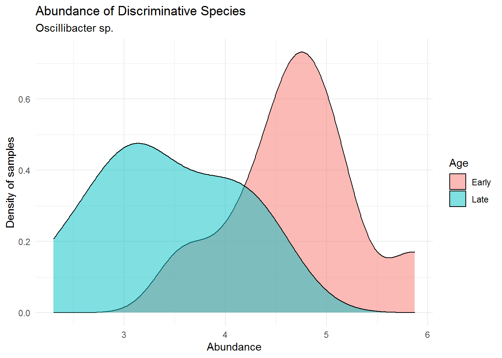
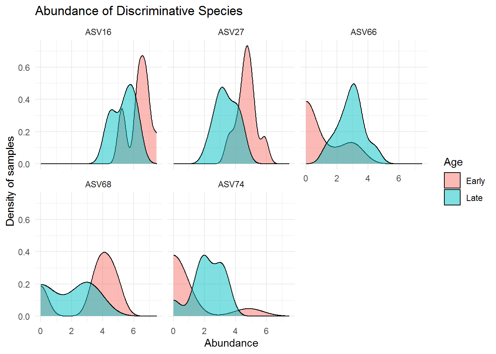

# Classification using Microbiome


The main microbiome analysis was already done in the previous chapter. But the result of previous chapter can be used further for additional analysis. In this capter we will demonstrate examples for doing supervised learning (a classification task) using microbiome data. 

The classification task enhanced by microbiome data relies on the sample we have, which was obtained based on a research question. Our research question provide a design where we can obtain sample from early or old aged mouse. After microbiome analysis, we knew that microbiome composition change with age. Therefore, we can try **classify whether a mouse is early or old aged based on the its gut microbioal composition**.

The package `caret` provides various functions for machine learning algorithm. We’ll try using the robust **Random Forest** algorithm on this one. For that we also need a `randomForest` package. Make sure that you have each of them installed and loaded into your session.


```r
# load library
library(caret)
library(randomForest)

# additional library for data tidying later
library(tidyr)
```

We'll be using microbial count or `otu_table` from `ps_cut` data which represent the microbial composition of our sample. This data is also already removed for its outlier. We'll also log-transform our data before analysis.


```r
ps_cut@otu_table[1:3,1:3]
```

```
## Loading required package: phyloseq
```

```
## OTU Table:          [3 taxa and 3 samples]
##                      taxa are columns
##        ASV5 ASV8 ASV11
## F3D0    173  185   111
## F3D1    140  191   284
## F3D141  190  324   225
```


```r
ps_cut_log <- transform_sample_counts(ps_cut, function(x) log(1 + x))
```


```r
ps_cut_log@otu_table[1:3,1:3]
```

```
## OTU Table:          [3 taxa and 3 samples]
##                      taxa are columns
##            ASV5     ASV8    ASV11
## F3D0   5.159055 5.225747 4.718499
## F3D1   4.948760 5.257495 5.652489
## F3D141 5.252273 5.783825 5.420535
```

The first step of classification (or any machine learning task) is to divide our data into **train** and **test** set. to ensure that the test set realistically simulates the collection of new data, we will be using random sampling to split the data.


```r
# get age label & microbiome data
data_ml <- data.frame(age = sample_data(ps_cut_log)$When, otu_table(ps_cut_log))
```


```r
head(data_ml)
```

```
##          age     ASV5     ASV8    ASV11    ASV15    ASV16    ASV27    ASV30
## F3D0   Early 5.159055 5.225747 4.718499 4.394449 6.801283 4.762174 3.784190
## F3D1   Early 4.948760 5.257495 5.652489 0.000000 6.857514 5.075174 5.010635
## F3D141  Late 5.252273 5.783825 5.420535 4.644391 5.468060 2.302585 3.610918
## F3D143  Late 4.875197 4.442651 4.905275 3.713572 4.343805 2.772589 1.791759
## F3D144  Late 4.663439 3.737670 5.808142 4.779123 4.584967 3.044522 2.397895
## F3D145  Late 5.733341 4.844187 5.963579 4.844187 4.532599 3.218876 2.484907
##        ASV34    ASV41    ASV44    ASV45    ASV46 ASV47    ASV48    ASV52 ASV53
## F3D0       0 3.610918 0.000000 5.170484 4.317488     0 4.454347 4.158883     0
## F3D1       0 2.708050 0.000000 5.159055 4.276666     0 4.248495 3.850148     0
## F3D141     0 4.219508 0.000000 4.234107 3.465736     0 2.197225 1.945910     0
## F3D143     0 3.713572 0.000000 3.637586 3.258097     0 2.197225 1.791759     0
## F3D144     0 3.688879 0.000000 2.079442 2.197225     0 2.708050 0.000000     0
## F3D145     0 3.806662 1.791759 2.995732 0.000000     0 2.484907 0.000000     0
##           ASV58 ASV60    ASV65    ASV66    ASV68    ASV71    ASV74    ASV81
## F3D0   4.454347     0 0.000000 3.218876 3.401197 0.000000 4.859812 3.091042
## F3D1   3.891820     0 0.000000 0.000000 4.499810 2.484907 0.000000 2.944439
## F3D141 0.000000     0 0.000000 2.833213 0.000000 2.833213 1.945910 0.000000
## F3D143 0.000000     0 0.000000 2.397895 0.000000 2.639057 1.386294 0.000000
## F3D144 0.000000     0 1.098612 3.091042 0.000000 2.302585 1.945910 0.000000
## F3D145 1.386294     0 1.609438 2.079442 2.197225 0.000000 2.995732 0.000000
##           ASV86    ASV89 ASV92    ASV94    ASV99 ASV101   ASV102   ASV111
## F3D0   0.000000 0.000000     0 3.951244 0.000000      0 2.708050 0.000000
## F3D1   1.098612 3.465736     0 3.784190 0.000000      0 2.079442 0.000000
## F3D141 0.000000 1.791759     0 0.000000 2.772589      0 2.302585 0.000000
## F3D143 0.000000 1.386294     0 2.708050 1.945910      0 1.945910 0.000000
## F3D144 0.000000 2.397895     0 2.708050 2.484907      0 2.397895 0.000000
## F3D145 0.000000 1.386294     0 2.944439 2.397895      0 2.708050 1.098612
##        ASV120 ASV121   ASV132   ASV141   ASV143 ASV145   ASV146   ASV164
## F3D0        0      0 2.944439 2.197225 3.044522      0 0.000000 1.386294
## F3D1        0      0 2.484907 2.197225 2.079442      0 2.302585 1.386294
## F3D141      0      0 0.000000 0.000000 0.000000      0 0.000000 0.000000
## F3D143      0      0 0.000000 0.000000 0.000000      0 0.000000 0.000000
## F3D144      0      0 0.000000 0.000000 0.000000      0 0.000000 1.386294
## F3D145      0      0 0.000000 1.386294 0.000000      0 1.386294 1.609438
##          ASV172   ASV177 ASV190   ASV191  ASV203 ASV208   ASV217 ASV224 ASV233
## F3D0   2.484907 2.564949      0 2.397895 0.00000      0 0.000000      0      0
## F3D1   0.000000 0.000000      0 0.000000 1.94591      0 0.000000      0      0
## F3D141 0.000000 0.000000      0 0.000000 0.00000      0 0.000000      0      0
## F3D143 0.000000 0.000000      0 0.000000 0.00000      0 0.000000      0      0
## F3D144 0.000000 0.000000      0 0.000000 0.00000      0 0.000000      0      0
## F3D145 0.000000 0.000000      0 0.000000 0.00000      0 2.079442      0      0
```


```r
# get index for sampling
set.seed(100)
idx_train <- sample(nrow(sample_data(ps_cut_log)), size = nrow(sample_data(ps_cut_log))*0.8)

# splitting train-test
training <- data_ml[idx_train,]
testing <- data_ml[-idx_train,]
```

Once we split the data, we can use the train function to fit the **Random Forest** model.


```r
rfFit <- train(age ~ ., 
               data = training,
               method = "rf")

rfFit
```

Next we can predict mouse age labels on the test set using `predict()` function.


```r
rfClasses <- predict(rfFit, 
                     newdata = testing)
```

Then we can do a quick model evaluation by using simple confusion matrix.


```r
# other options use: `confusionMatrix()`
table(pred = rfClasses, 
      actual = testing$age)
```

```
##        actual
## pred    Early Late
##   Early     2    0
##   Late      0    2
```

We'll there is accuracy 100%, but please note that the number of data we have for this demonstration is still very low. It might be better to train and test the model with a larger sample size, for example 30-300 sample or more. 

To better understand the fitted random forest model, we can identify which microbe have the highest influence in the random forest prediction. We can use the function `importance()` from `randomForest` package and to find out each variable or in our case microbial species importance:


```r
importance(rfFit$finalModel)
```

```
##        MeanDecreaseGini
## ASV5        0.125397702
## ASV8        0.219382928
## ASV11       0.163005528
## ASV15       0.271417316
## ASV16       0.333647808
## ASV27       0.405051571
## ASV30       0.239835786
## ASV34       0.000000000
## ASV41       0.148721834
## ASV44       0.014960373
## ASV45       0.141743723
## ASV46       0.165285570
## ASV47       0.000000000
## ASV48       0.147208791
## ASV52       0.255870751
## ASV53       0.000000000
## ASV58       0.242872006
## ASV60       0.000000000
## ASV65       0.086742524
## ASV66       0.280912821
## ASV68       0.301280131
## ASV71       0.117645455
## ASV74       0.306883006
## ASV81       0.175225974
## ASV86       0.069356466
## ASV89       0.106354057
## ASV92       0.000000000
## ASV94       0.131035786
## ASV99       0.268397036
## ASV101      0.000000000
## ASV102      0.087275169
## ASV111      0.016042025
## ASV120      0.000000000
## ASV121      0.163664924
## ASV132      0.221767621
## ASV141      0.240852081
## ASV143      0.103141114
## ASV145      0.000000000
## ASV146      0.058373826
## ASV164      0.098591275
## ASV172      0.070926607
## ASV177      0.068640637
## ASV190      0.024858841
## ASV191      0.008968032
## ASV203      0.063437085
## ASV208      0.026504762
## ASV217      0.010176623
## ASV224      0.023548452
## ASV233      0.029568909
```

The function above shown all the variable importance, but we only need one microbe with the highest importance. In this case "ASV27". Let's use some function to simply take out that microbe and find out its taxonomy so we can analyze it further.


```r
# obtain taxonomy of all microbial sample
tax_rf <- tax_table(ps_cut_log)
```


```r
# filter microbes with the highest importance
tax_rf[which.max(importance(rfFit$finalModel)),]
```

```
## Taxonomy Table:     [1 taxa by 7 taxonomic ranks]:
##       Kingdom    Phylum       Class        Order             Family            
## ASV27 "Bacteria" "Firmicutes" "Clostridia" "Oscillospirales" "Oscillospiraceae"
##       Genus           Species
## ASV27 "Oscillibacter" NA
```

This turns out to be a microbe from order *Oscillospirales*, family *Oscillospiraceae*, and genus *Oscillibacter*. Let's try plots its abundance across samples.


```r
# get microbial abundance
imp_abd <- as.vector(otu_table(ps_cut_log)[,"ASV27"])

# combine with sample data
imp_df <- data.frame(sample_data(ps_cut_log),
                     abund = imp_abd)

# plotting
imp_plot<- ggplot(imp_df, aes(x = abund)) + 
  geom_density(aes(fill = When),
              alpha = 0.5) +
  labs(title = "Abundance of Discriminative Species",
     subtitle = "Oscillibacter sp.",
     x = "Abundance",
     y = "Density of samples",
     fill = "Age") +
  # below is for aesthetics
  theme_minimal()
```


```r
imp_plot
```



We can see that *Oscillibacter sp.* has lower abundance in the mouse early age (0-9 days) and much higher in its late age (141-150). This is an interesting fact to point out, that although from the previous chapter (Microbiome Analysis), the order *Oscillospirales* was not the most dominant order present in the community, it may harbours spesific microbes that greatly distinguish between different treatments of our sample (in this case early and late mice age). We may have failed in detecting this microbe because of a poorly visualized microbial abundance where we colored them using only Phylum/Order (not detailed enough to genus for ASV27). That is why a further data analysis is highly recommended after analyzing microbial abundance using plot or visual.

We can also track down several microbes that have high influence on the model decision:


```r
# obtain the importance of microbes on rf model
rf_imp <- data.frame(importance(rfFit$finalModel))
```


```r
# obtain 5 microbes with highest importance
rf_imp %>% 
  mutate(ASV = rownames(.)) %>% 
  arrange(desc(MeanDecreaseGini)) %>% 
  head(5)
```

```
##   MeanDecreaseGini   ASV
## 1        0.4050516 ASV27
## 2        0.3336478 ASV16
## 3        0.3068830 ASV74
## 4        0.3012801 ASV68
## 5        0.2809128 ASV66
```


```r
# saving ASV to object
asv_imp <- rf_imp %>% 
  mutate(ASV = rownames(.)) %>% 
  arrange(desc(MeanDecreaseGini)) %>% 
  head(5) %>% 
  pull(ASV)
```


```r
# obtain taxonomy for those ASVs
data.frame(tax_rf) %>% 
  filter(rownames(.) %in% asv_imp)
```

```
##        Kingdom           Phylum          Class             Order
## ASV16 Bacteria       Firmicutes     Clostridia    Lachnospirales
## ASV27 Bacteria       Firmicutes     Clostridia   Oscillospirales
## ASV66 Bacteria Actinobacteriota Actinobacteria Bifidobacteriales
## ASV68 Bacteria       Firmicutes     Clostridia    Lachnospirales
## ASV74 Bacteria       Firmicutes     Clostridia     Clostridiales
##                   Family                         Genus Species
## ASV16    Lachnospiraceae Lachnospiraceae_NK4A136_group    <NA>
## ASV27   Oscillospiraceae                 Oscillibacter    <NA>
## ASV66 Bifidobacteriaceae               Bifidobacterium    <NA>
## ASV68    Lachnospiraceae                 Acetatifactor    <NA>
## ASV74     Clostridiaceae   Clostridium_sensu_stricto_1    <NA>
```

The above microbes may distinguish greatly between mice with early and late age. Below are the visualization of the abundance for those microbes:


```r
# get microbial abundance
imp_abd_asv <- data.frame(otu_table(ps_cut_log)[,asv_imp])

# combine with sample data
imp_df_asv <- data.frame(sample_data(ps_cut_log)) %>% 
  cbind(imp_abd_asv) %>% 
  pivot_longer(cols = asv_imp,
               names_to = "ASV", values_to = "Abundance")
```


```r
head(imp_df_asv, 10)
```

```
## # A tibble: 10 x 6
##    Subject Gender   Day When  ASV   Abundance
##    <fct>   <fct>  <int> <fct> <chr>     <dbl>
##  1 3       F          0 Early ASV27      4.76
##  2 3       F          0 Early ASV16      6.80
##  3 3       F          0 Early ASV74      4.86
##  4 3       F          0 Early ASV68      3.40
##  5 3       F          0 Early ASV66      3.22
##  6 3       F          1 Early ASV27      5.08
##  7 3       F          1 Early ASV16      6.86
##  8 3       F          1 Early ASV74      0   
##  9 3       F          1 Early ASV68      4.50
## 10 3       F          1 Early ASV66      0
```

```r
# plotting
imp_plot_asv <- ggplot(imp_df_asv, aes(x = Abundance)) + 
  geom_density(aes(fill = When),
              alpha = 0.5) +
  facet_wrap(~ASV) +
  labs(title = "Abundance of Discriminative Species",
     # subtitle = "Oscillibacter sp.",
     x = "Abundance",
     y = "Density of samples",
     fill = "Age") +
  # below is for aesthetics
  theme_minimal()
```


```r
imp_plot_asv
```



In the practice, It is even better to analyze the coherence of this microbiome analysis with other information regarding metabolic activities (perhaps transcriptomic and metabolomic study) happened during the mice growth. Therefore we can analyze how the microbiome affect the mice metabolic activities.
