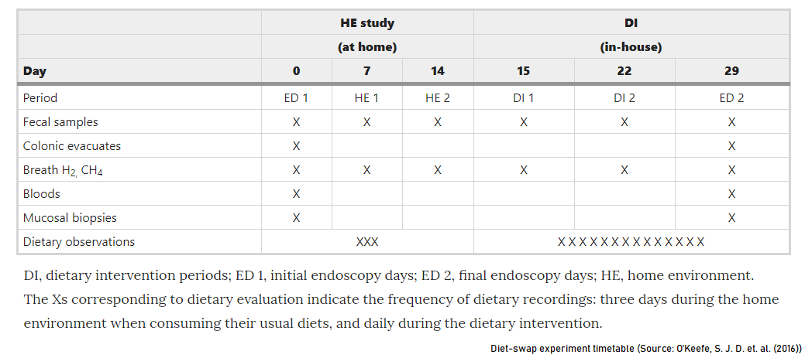
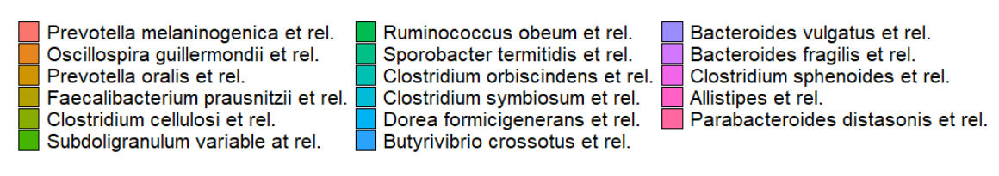

<style>
h1.title {
  text-align: center;
}
h4.author {
  text-align: center;
}
h4.date {
  text-align: center;
}

body {
text-align: justify}

</style>

```{r setup, include=FALSE}
# clear-up the environment
rm(list = ls())

# chunk options
knitr::opts_chunk$set(
  message = FALSE,
  warning = FALSE,
  fig.align = "center",
  comment = "#>"
)
```

# Introduction

Abundant number of microbes lives everywhere on earth and in our bodies. Microbiome Analysis aims to get to know them to utilize them for our benefit. Human Microbiome is one of the focus in microbiome research in this past few years. Researchers are trying to find out the microbial community profile and dynamics that lives inside the human body which may indicates a risk of certain diseases and even indirectly steer our whims and behaviour through out the day.  

The workflow of microbiome analysis has evolved through out the years. The development of technology and Bioinformatics has made a massive increment on the generation of genomic data that is used for microbiome analysis. Therefore, the use of programming tools such as R and its packages is becoming more widely used.

With the development of [*next generation sequencing*](https://www.ncbi.nlm.nih.gov/pmc/articles/PMC3841808/), microbial DNA sequences has become more easier to obtain, resulting a massive increment on genomic data that is used for microbiome analysis. There are various tools we can use to perform microbiome analysis, and one of them is using R. 

One of the package that helps with microbiome analysis is `microbiome`. **microbiome** R package facilitates exploration and analysis of microbiome profiling data, in particular [16S taxonomic profiling](https://www.sevenbridges.com/taxonomic-profiling-of-metagenomics-samples-get-to-know-your-loyal-residents/) whereas we use 16S rRNA gene sequences as profiles for each microbe. The microbiome package extends the [phyloseq data format](https://joey711.github.io/phyloseq/) and includes a comprehensive tutorial for large-scale microbiome analysis and visualization. This package is under the development and maintained by **Leo Lahti, et al. (2020)**. You can find the detailed source and documentation for this package in [here](https://microbiome.github.io/tutorials/). 

In this article, We will try to uncover some of the most used microbiome analysis today, performed using R with the help of `microbiome` package. We will analyze Human's Digestive System microbial community profile between African Americans and Native South Africans and its relation to the risk of colon cancer as previously studied by O’Keefe, Stephen J. D. et. al. (2016)[^1]. 

<br>
<center>

</center>
<br>

Colon cancer is the second leading cause of cancer death in the west. It is previously known that African Americans has higher colon cancer rates (65:100000) than Native South Africans (<5:1000000). There are certain microbes that act as biomarkers of colon cancer. it is said that the microbes lives inside our digestion system are influenced by the type of diet we eat. A 2-week food exchanges (diet-swap) experiment is performed on subjects from the same populations where African Americans were fed a *high-fibre low-fat African-style diet* while Native South Africans were fed a *low-fibre western-style diet*. The digestive system's microbial community profile were obtained from fecal sample of each subject. The idea is to see whether the diet-swap changes the composition of microbes lives inside our digestive system and can possibly alter the risk of colon cancer.

> The idea is to see whether the diet-swap changes the composition of microbes lives inside our digestive system and can possibly alter the risk of colon cancer.

**Note**: This article explains a more simple workflow of microbiome analysis in R. If you are interested in the full workflow (including amplicon bioinformatics which turns raw sequence data into phyloseq object that can be easily analyzed using various packages), go to the full **mirobiome book** [here](https://microbiome.netlify.app/)!

# Import Library

The R package we are going to use, `microbiome`, is available from [Bioconductor](https://bioconductor.org/). The current release of Bioconductor is version 3.11; it works with R version 4.0.0. To install the package we need specify certain command. First, we will install Bioconductor base packages:

```{r eval=FALSE}
# install Bioconductor base packages
if (!requireNamespace("BiocManager", quietly = TRUE))
install.packages("BiocManager")
BiocManager::install(version = "3.11")

# install `microbiome` package
BiocManager::install("microbiome")
```

```{r message=FALSE, warning=FALSE}
# import library
library(microbiome)
library(dplyr) # for easier data tidying
```

# The Data

The microbiome package relies on the independent *phyloseq data format* which may consist of: 

* OTU table (microbial species/taxa abundance for each community sample), 
* sample metadata (age, BMI, sex, etc.),
* taxonomy table (mapping between OTUs and higher-level taxonomic classifications),
* phylogenetic tree (relations between the OTU/taxa).

**TL;DR** | Operational Taxonomic Units (OTUs) or the estimated distinct species present in the community. 

Below is the example data from the experiment (as described before) which was already provided inside the `microbiome` package. The data already stored in a phyloseq format and therefore *we will not perform data pre-processing*. 

```{r}
# obtaining data from package
data("dietswap")
dietswap
```

The raw dataset is usually a sequence data from the Next Generation Sequencing (NGS) platform. The NGS platform allows the DNA sequencing practice to all the microbes present in numerous microbial communities simultaneously. The NGS raw data may be pre-processed first using a software Quantitative Insight to Microbial Ecology (QIIME2) based on Python language, or using R packages such as phyloseq and DADA2. The data pre-processing will expand from converting raw sequence data into a phyloseq object. For such detailed tutorial, you can explore [the microbiome book](https://microbiome.netlify.app/)! 

As you can see, we already have: 

**1. OTU Table containing 130 species (taxa) from 222 samples**

The columns here indicate the samples from the experiment while the rows indicate operational taxonomic units (OTUs) or we may as well called it estimated species. 

Each sample here is a community of microbes that was sampled from a person's mucosa that undergoes the diet-swap treatment in specific time point. The number in each column indicates the total number for each species for each sampling. There are 130 species that may be present in the sample.

```{r}
# first 10 microbes for first 7 sample
dietswap@otu_table@.Data[1:10,1:7] %>% 
  data.frame() # just for tidy display
```

**2. Sample Data (metadata) containing 8 variables**

The metadata contains detailed information about sample data. From this we can see how the experiment was done. We can vaguely see the research design, the number of persons and timepoints the researcher used to obtain the full data. 

```{r}
# converting metadata into a tidy data.frame
metadata <- meta(dietswap)

# inspect metadata
head(metadata)
```
For later analysis, it might be better to transform the variable `timepoint` and `timepoint.within.group` into factor.

```{r}
# correcting data types
metadata <- metadata %>% 
  mutate(timepoint = as.factor(timepoint),
         timepoint.within.group = as.factor(timepoint.within.group))
```

```{r}
# you can also use summary
summary(metadata)
```

Description for each column is below:

* **subject**: initials of the subject being experimented
* **sex**: sex of the subject
* **nationality**: Nationality 
  + AFR: Native South Africans 
  + AAM: African Americans
* **group**: Sample treatment group
  + Dietary intervention (DI)
  + Home environment or consuming usual diets(HE) 
  + [Solid stool pre-colonoscopy](https://ada.com/preparing-for-a-colonoscopy/) (ED)
* **sample**: sample ID
* **timepoint**: Time point in the overall data set 
  + 1-6
* **timepoint.within.group**: Time point (1/2) within the group (ED/HE/DI)
* **bmi_group**: Standard body-mass classification
  + lean: 18.5-25 
  + overweight: 25-30
  + obese: 30-35

A more detailed information about the research design and experiment can be accessed [here](https://www.nature.com/articles/ncomms7342#Tab1).

The diet-swap treatment were diveded into three stages group as described above. As total, there are 6 timepoints in the experiment:

* ED1: initial endoscopy as the microbial community profile while on their usual diet before the diet-swap tretment
* HE (1&2): Home environment while on their usual diet prior to diet-swap
* DI (1&2): Dietary environment while on diet-swap treatment
* ED 2: final endoscopy as the microbial community profile at the conclusion of the diet-swap experiment 

<br>
<center>

</center>
<br>

**3. Taxonomy Table for 130 species with 3 taxonomic ranks (Genus, Family, Phylum)**

Lastly is the Taxonomy Table which shows the Taxonomy of each species.

```{r}
taxon <- tax_table(dietswap)
head(taxon)
```

We can also join all those three component into a data.frame using `psmelt()`. The data.frame format might be easier for manual visualization using `ggplot2` packages.

```{r}
diet <- psmelt(dietswap)
head(diet)
```
Meanwhile, I will try to utilize plotting functions from the package microbiome and see what we can explore. The first thing we can do is perhaps plotting the frequency or proportion of each obese category and the distribution of our sample group. We can use plot_frequency as below:

```{r fig.align='center'}
# EDA for bmi group proportion for each nationality
plot_frequencies(x = sample_data(dietswap), 
                 Groups = "bmi_group", Factor = "nationality") +
  
  # below are ggplot2 functions for prettier visual
  labs(fill = "Nationality") +
  theme_minimal() +
  theme(axis.text.x = element_text(angle = 0, hjust = 0.5))
```

Based on the plot, we can see that African American (AAM) people generally dominates the proportion for overweight and obese category, while Native Africans (AFR) dominates the lean category. Additionaly, it is also widely known that obesity may also promotes colon cancer. 

The following discussion will focuses on the microbial community analysis that can support the discussion from this section. There might be different abundance or diversity of microbes, and even some specific microbes that appear higher in African Americans or the other way around.

# Microbiome Analysis

The main focus in microbiome analysis is to explore and gain insight from the **microbial community profile** provided. The community is usually visualized using barplot containing all the present microbes in the sample. Before visualization, it is better to filter only prevalent taxa that present in the community. Prevalent taxa means that these taxa were frequently appear in all of our sample. 

```{r}
# filtering prevalent taxa
core_diet <- core(x = dietswap, 
                  detection =  50, # treshold for presence for each OTU in a sample
                  prevalence = 50/100) # treshold for the fraction of OTUs that exceeds detection treshold
core_diet # reveals only 17 prevalent species
```

## Exploring Pattern with PCoA Plot

The first thing we ought to explore is to see whether there are spesific pattern that explains our data,. We can try perform multivariate projection of our sample data, spesifically using the OTU Table or the microbial abundance data for each sample. Before plotting, I'd like to transform our abundance data into its log value as an approximate variance stabilizing transformation ([Ben J. Callahan, 2016](https://doi.org/10.12688/f1000research.8986.2)).

```{r}
# log-transform data
diet_log <- transform_sample_counts(core_diet, function(x) log(1 + x))
```

```{r}
# ordinate the data
set.seed(100)
ord <- ordinate(physeq = diet_log, 
                method = "MDS", # MDS/PCoA
                distance = "bray") # distance or dissimilarity method

# prepare eigen values to adjust axis
evals <- ord$values$Eigenvalues
```

```{r}
# plotting
plot_ordination(physeq = diet_log, 
                ordination = ord) +
                geom_point(size = 2) +
  coord_fixed(sqrt(evals[2] / evals[1])) 
```
Based on the plot, there seems to be no extreme outlier in our data. We can proceed with further analysis using this data. 

Additionally, I would also like to plot the samples labelled "1" for its `time point`, representing samples prior to dietswap treatment. We can inspect whether there is a spesific variable that is distinguishable based on our microbial composition data.

```{r}
diet_log_prior <- subset_samples(diet_log, timepoint.within.group == 1)
```

```{r}
# ordinate the data
set.seed(100)
ord <- ordinate(physeq = diet_log_prior, 
                method = "MDS", # MDS/PCoA
                distance = "bray") # distance or dissimilarity method

# prepare eigen values to adjust axis
evals <- ord$values$Eigenvalues
```

```{r}
# plotting
plot_ordination(physeq = diet_log_prior, 
                ordination = ord,
                color = "nationality") +
                geom_point(size = 2) +
  labs(col = "Nationality") +
  coord_fixed(sqrt(evals[2] / evals[1])) 
```
From the plot above, when plotting the microbial composition or our sample, the variable `nationality` can be decently distinguished. We can confirm that there is a different composition between American African and Native African subjects. 

Our study is to determine whether dietswap can change the composition of the initial microbial composition between African American and Native Africans. To better visualize the difference of microbial composition between subjects with different nationality, we can also plot the microbial abundance which will be discussed next.

## Microbial Abundance Plot

Microbial communities are often visualized in the form of **Stacked Barplot**. Each bar representing one sample community and harbours different abundance and diversity of microbes. One can analyze the dominant microbes for each sample community or each group sample.

Before plotting, it is better to transform our original microbial abundance data into its relative abundance (frequencies of microbes present per total count for each sample).

```{r}
# transform
diet_relav <- microbiome::transform(core_diet, "compositional")

# inspect
diet_relav@otu_table@.Data[1:3,1:3]
```

Microbial abundance plot are best to visualize the changing of microbial communities through out a specific time events during various treatments. For easier viewing and examples, We will use the subsetted data from our full `dietswap` data.

```{r}
# filtering data based on label/condition
afr_lean <- subset_samples(diet_relav, nationality == "AFR" & bmi_group == "lean")
afr_over <- subset_samples(diet_relav, nationality == "AFR" & bmi_group == "overweight")
afr_obese <- subset_samples(diet_relav, nationality == "AFR" & bmi_group == "obese")

aam_lean <- subset_samples(diet_relav, nationality == "AAM" & bmi_group == "lean")
aam_over <- subset_samples(diet_relav, nationality == "AAM" & bmi_group == "overweight")
aam_obese <- subset_samples(diet_relav, nationality == "AAM" & bmi_group == "obese")
```

```{r fig.width=8, fig.align='center'}
# plot averaged sample
plot_composition(afr_lean,
              taxonomic.level = "Genus",
              average_by = "timepoint", # average by timepoint
              otu.sort = "abundance",
              x.label = "timepoint") +
     labs(x = "Time point",
          y = "Abundance",
          title = "Native African - Lean") +
     theme(axis.text.x = element_text(angle = 0,
                                      hjust = 0.5
                                      ))
```

To capture the overall picture of microbial community for each treatment I will use the averaged plot and combine the plot from all treatment using `ggarrange()` from `ggpubr` package.

```{r}
# plot the averaged microbial composition sample
plot_afr_lean <- plot_composition(afr_lean,
              taxonomic.level = "Genus",
              average_by = "timepoint", # average by timepoint
              otu.sort = "abundance") +
     labs(x = "Lean",
          y = "Abundance") +
     theme_minimal() +
     theme(axis.text.x = element_text(angle = 0,
                                      hjust = 0.5),
           legend.position = "none")

plot_afr_over <- plot_composition(afr_over,
              taxonomic.level = "Genus",
              average_by = "timepoint", # average by timepoint
              otu.sort = "abundance") +
     labs(x = "Overweight", y = "") +
     theme_minimal() +
     theme(axis.text.x = element_text(angle = 0,
                                      hjust = 0.5),
           legend.position = "none",
           axis.text.y = element_blank())

plot_afr_obese <- plot_composition(afr_obese,
              taxonomic.level = "Genus",
              average_by = "timepoint", # average by timepoint
              otu.sort = "abundance") +
     labs(x = "Obese", y = "") +
     theme_minimal() +
     theme(axis.text.x = element_text(angle = 0,
                                      hjust = 0.5),
           legend.position = "none",
           axis.text.y = element_blank())

plot_aam_lean <- plot_composition(aam_lean,
              taxonomic.level = "Genus",
              average_by = "timepoint", # average by timepoint
              otu.sort = "abundance") +
     labs(x = "Lean",
          y = "Abundance") +
     theme_minimal() +
     theme(axis.text.x = element_text(angle = 0,
                                      hjust = 0.5),
           legend.position = "none")

plot_aam_over <- plot_composition(aam_over,
              taxonomic.level = "Genus",
              average_by = "timepoint", # average by timepoint
              otu.sort = "abundance") +
     labs(x = "Overweight", y = "") +
     theme_minimal() +
     theme(axis.text.x = element_text(angle = 0,
                                      hjust = 0.5),
           legend.position = "none",
           axis.text.y = element_blank())

plot_aam_obese <- plot_composition(aam_obese,
              taxonomic.level = "Genus",
              average_by = "timepoint", # average by timepoint
              otu.sort = "abundance") +
     labs(x = "Obese", y = "") +
     theme_minimal() +
     theme(axis.text.x = element_text(angle = 0,
                                      hjust = 0.5),
           legend.position = "none",
           axis.text.y = element_blank())
```

```{r fig.width = 9, fig.height = 3}
# combine plots
library(ggpubr)

af <- ggarrange(plot_afr_lean, plot_afr_over, plot_afr_obese, nrow = 1,
          widths = c(1.2,1,1))
am <- ggarrange(plot_aam_lean, plot_aam_over, plot_aam_obese, nrow = 1,
          widths = c(1.2,1,1))
```

```{r fig.height = 6, fig.width = 9}
ggarrange(af, am, nrow = 2, labels = c("  Native African","African American"), vjust = 1,font.label = list(size = 12, face = "bold"))
```

<br>
<center>

</center>
<br>

Above is the final compiled plot of microbial community dynamics throughout diet-swap experiment. Changes were seen in subjects with **Native African** nationality within the BMI group **Lean** and **Overweight**. Even so, there seems no significant changes in the microbial composition for subjects with **Native African** nationality within the BMI group **Obese** and with **African American** nationality. This indicates that the diet-swap treatment only affect spesific groups of subjects.

Throughout dietswap treatment, a decrease of *Prevotella melaninogenica et rel.*  abundance (colored coral) followed by the increase of *Oscillospira guillermondii et rel.* abundance (colored by orange) can be seen. The changes in microbial composition may be caused by different nutrients that were supplied from the diets during diet-swap treatment. As we know, the African Americans were fed with a *high-fibre low-fat African-style diet*. These nutrients may surpressed or promoted the growth of spesific microbes and resulting a shift in microbial composition. 

Additionally, it is quite interesting that if you look at the community structure, the microbial composition only changes in samples with one or few microbes dominates the communities.

In general, we can conclude that diet-swap treatment can shift microbial composition inside our digestive system. Further analysis about what microbes increased/decreased in growth on subject with specific target (healthy/colon cancer) might give us more light about the microbial composition connection to colon cancer and what actually happened inside our digestive system. In fact, a more throughout scientific study using this data and a couple of additional data has already been done and published. If you're interested, I encourage you to look to the read the published article as stated in the footnote.

There are so much more that can be explored and the journey of microbiome analysis and its application is only starting here. The realms of microbiome analysis is very interesting and I hope this simple article can help you start your Microbiome Analysis journey. Feel free to visit the full tutorial on microbiome analysis in [the microbiome book](https://microbiome.netlify.app/). Have fun exploring other various functions and packages in R, Python, or other tools to help you discover this magnificent world. 

Thank you for reading and Happy Learning!

[^1]: O’Keefe, S., Li, J., Lahti, L. et al. [Fat, fibre and cancer risk in African Americans and rural Africans](https://www.nature.com/articles/ncomms7342). Nat Commun 6, 6342 (2015) doi:10.1038/ncomms7342

***
